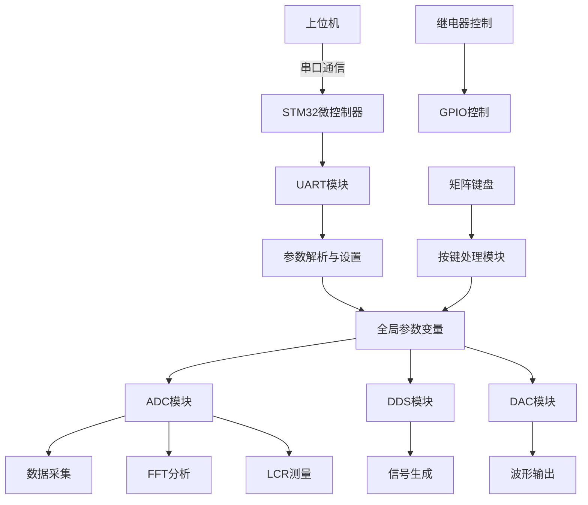

# STM32 Accelerator 系统设计文档

## 1. 系统架构概述

本系统基于 STM32 微控制器，主要实现以下功能：

1. ADC 数据采集与处理
2. DDS 信号生成
3. DAC 波形输出
4. 串口通信控制
5. LCR 测量功能

## 2. 全局变量定义

根据系统需求，需要定义以下全局变量用于参数控制：

### 2.1 DDS 相关参数

```c
// DDS期望频率 (Hz)
extern uint32_t g_desired_dds_frequency;

// DDS期望类型 (AD9833, AD9954等)
extern uint8_t g_desired_dds_type;

// DDS期望相位 (度)
extern uint32_t g_desired_dds_phase;

// DDS期望幅度
extern uint32_t g_desired_dds_amplitude;
```

### 2.2 ADC 相关参数

```c
// ADC期望采样率 (Hz)
extern uint32_t g_desired_ADC_sample_rate_Hz;
```

### 2.3 DAC 相关参数

```c
// DAC输出期望波形 (正弦波、方波、三角波等)
extern uint8_t g_desired_DAC_output_waveform;

// DAC输出期望频率 (Hz)
extern uint32_t g_desired_DAC_output_frequency;

// DAC输出期望幅度 (电压值)
extern float32_t g_desired_DAC_single_output_amplitude;
```

### 2.4 继电器控制参数

```c
// 控制哪个继电器
extern uint8_t g_desired_switch2which_relay;
```

### 2.5 功能状态参数

```c
// 功能状态枚举
typedef enum {
    LCR_STATE = 0,      // LCR表测量功能
    SPECTRUM_STATE,     // 频谱分析功能
    TIME_STATE,         // 时域分析功能
    DIY_STATE           // 自定义功能
} function_state_t;

// 期望功能状态
extern function_state_t g_desired_function_state;
```

### 2.6 频谱数据缓冲区

```c
// ADC1频谱数据缓冲区
extern float32_t g_adc1_spectrum_data[FFT_LENGTH / 2];

// ADC2频谱数据缓冲区
extern float32_t g_adc2_spectrum_data[FFT_LENGTH / 2];
```

## 3. 全局变量实现说明

### 3.1 头文件声明

需要创建 `my_parameter_config.h` 头文件，在其中声明所有全局变量：

```c
#ifndef MY_PARAMETER_CONFIG_H
#define MY_PARAMETER_CONFIG_H

#include "arm_math.h"
#include "my_freq_config.h"

// DDS相关参数
extern uint32_t g_desired_dds_frequency;
extern uint8_t g_desired_dds_type;
extern uint32_t g_desired_dds_phase;
extern uint32_t g_desired_dds_amplitude;

// ADC相关参数
extern uint32_t g_desired_ADC_sample_rate_Hz;

// DAC相关参数
extern uint8_t g_desired_DAC_output_waveform;
extern uint32_t g_desired_DAC_output_frequency;
extern float32_t g_desired_DAC_single_output_amplitude;

// 继电器控制参数
extern uint8_t g_desired_switch2which_relay;

// 功能状态参数
typedef enum {
    LCR_STATE = 0,
    SPECTRUM_STATE,
    TIME_STATE,
    DIY_STATE
} function_state_t;

extern function_state_t g_desired_function_state;

// 频谱数据缓冲区
extern float32_t g_adc1_spectrum_data[FFT_LENGTH / 2];
extern float32_t g_adc2_spectrum_data[FFT_LENGTH / 2];

#endif // MY_PARAMETER_CONFIG_H
```

### 3.2 源文件定义

需要创建 `my_parameter_config.c` 源文件，在其中定义所有全局变量：

```c
#include "my_parameter_config.h"

// DDS相关参数
uint32_t g_desired_dds_frequency = 1000;        // 默认1kHz
uint8_t g_desired_dds_type = 1;                 // 默认AD9833
uint32_t g_desired_dds_phase = 0;               // 默认0度
uint32_t g_desired_dds_amplitude = 16383;       // 默认最大幅度

// ADC相关参数
uint32_t g_desired_ADC_sample_rate_Hz = 2000000; // 默认2MHz

// DAC相关参数
uint8_t g_desired_DAC_output_waveform = 0;      // 默认正弦波
uint32_t g_desired_DAC_output_frequency = 1000; // 默认1kHz
float32_t g_desired_DAC_single_output_amplitude = 0.7f; // 默认0.7V

// 继电器控制参数
uint8_t g_desired_switch2which_relay = 0;       // 默认继电器0

// 功能状态参数
function_state_t g_desired_function_state = LCR_STATE; // 默认LCR状态

// 频谱数据缓冲区
float32_t g_adc1_spectrum_data[FFT_LENGTH / 2] = {0};
float32_t g_adc2_spectrum_data[FFT_LENGTH / 2] = {0};
```

## 4. 串口通信协议设计

### 4.1 协议格式

采用 `CMD:PARAM:VALUE` 格式，使用回车符(0x0D)作为结束符。

### 4.2 命令定义

#### 4.2.1 设置参数命令 (SET)

用于设置系统参数：

- `SET:DDS_FREQ:value` - 设置 DDS 频率
- `SET:ADC_RATE:value` - 设置 ADC 采样率
- `SET:DDS_TYPE:value` - 设置 DDS 类型 (AD9833 或 AD9954)
- `SET:DDS_PHASE:value` - 设置 DDS 相位
- `SET:DDS_AMP:value` - 设置 DDS 幅度
- `SET:DAC_WAVE:value` - 设置 DAC 波形 (SINE, SQUARE, TRIANGLE)
- `SET:DAC_FREQ:value` - 设置 DAC 频率
- `SET:DAC_AMP:value` - 设置 DAC 幅度
- `SET:RELAY:value` - 设置继电器
- `SET:FUNC:value` - 设置功能状态 (LCR, SPECTRUM, TIME, DIY)

#### 4.2.2 查询命令 (GET)

用于查询系统状态：

- `GET:ALL` - 获取所有参数状态
- `GET:DDS_FREQ` - 获取 DDS 频率
- `GET:ADC_RATE` - 获取 ADC 采样率
- 等等...

### 4.3 参数值定义

#### 4.3.1 DDS 类型

- `AD9833` - 对应值: 1
- `AD9954` - 对应值: 0

#### 4.3.2 DAC 波形

- `SINE` - 正弦波
- `SQUARE` - 方波
- `TRIANGLE` - 三角波

#### 4.3.3 功能状态

- `LCR` - LCR 测量功能
- `SPECTRUM` - 频谱分析功能
- `TIME` - 时域分析功能
- `DIY` - 自定义功能

## 5. UART 任务修改设计

### 5.1 新的 UART 任务实现

需要修改 `my_uart_task.c` 文件以支持新协议：

```c
#include "my_uart_task.h"
#include "my_parameter_config.h" // 包含参数配置头文件
#include "my_button_config.h"    // 包含矩阵键盘配置
#include "my_zlcr_config.h"      // 包含DDS控制函数

extern UART_HandleTypeDef huart1;

char rx_buffer[RX_BUFFER_SIZE];   // 接收数据
uint8_t aRxBuffer;                // 接收中断缓冲
uint8_t uart1_rx_cnt = 0;         // 接收缓冲计数
uint8_t g_uart1_ex_flag = 0;      // UART1接收标志

void StartUARTProcessingTask(void const * argument)
{
    // UART任务代码
    HAL_UART_Receive_IT(&huart1, (uint8_t *)&aRxBuffer, 1);
    for(;;)
    {
        /* 串口接收中断 */
        if (g_uart1_ex_flag)
        {
            g_uart1_ex_flag = 0;

            // 解析接收到的字符串
            parse_uart_command(rx_buffer);

            uart1_rx_cnt = 0;
            memset(rx_buffer, 0, sizeof(rx_buffer));
        }

        osDelay(20); // 延时20ms
    }
}

/**
 * @brief 解析UART命令
 * @param cmd 接收到的命令字符串
 */
void parse_uart_command(char* cmd)
{
    // 解析命令格式: CMD:PARAM:VALUE
    char *token;
    char *cmd_type;
    char *param;
    char *value;

    // 使用strtok分割字符串
    token = strtok(cmd, ":");
    if (token == NULL) {
        printf("Invalid command format\n");
        return;
    }
    cmd_type = token;

    token = strtok(NULL, ":");
    if (token == NULL) {
        printf("Invalid command format\n");
        return;
    }
    param = token;

    token = strtok(NULL, ":");
    if (token == NULL) {
        printf("Invalid command format\n");
        return;
    }
    value = token;

    // 处理SET命令
    if (strcmp(cmd_type, "SET") == 0) {
        handle_set_command(param, value);
    }
    // 处理GET命令
    else if (strcmp(cmd_type, "GET") == 0) {
        handle_get_command(param);
    }
    // 兼容旧格式
    else {
        handle_legacy_command(cmd);
    }
}

/**
 * @brief 处理SET命令
 * @param param 参数名
 * @param value 参数值
 */
void handle_set_command(char* param, char* value)
{
    if (strcmp(param, "DDS_FREQ") == 0) {
        g_desired_dds_frequency = (uint32_t)strtoul(value, NULL, 10);
        printf("Set DDS frequency: %lu Hz\n", g_desired_dds_frequency);
        // 更新DDS频率
        if (g_desired_dds_type == DDS_TYPE_AD9833) {
            AD9833_WaveSeting(g_desired_dds_frequency, g_desired_dds_phase, SIN_WAVE, 0);
        } else {
            AD9954_Set_Fre(g_desired_dds_frequency);
        }
    }
    else if (strcmp(param, "ADC_RATE") == 0) {
        g_desired_ADC_sample_rate_Hz = (uint32_t)strtoul(value, NULL, 10);
        printf("Set ADC sample rate: %lu Hz\n", g_desired_ADC_sample_rate_Hz);
    }
    else if (strcmp(param, "DDS_TYPE") == 0) {
        if (strcmp(value, "AD9833") == 0) {
            g_desired_dds_type = DDS_TYPE_AD9833;
            printf("Set DDS type: AD9833\n");
        } else if (strcmp(value, "AD9954") == 0) {
            g_desired_dds_type = DDS_TYPE_AD9954;
            printf("Set DDS type: AD9954\n");
        } else {
            printf("Invalid DDS type\n");
        }
    }
    else if (strcmp(param, "DDS_PHASE") == 0) {
        g_desired_dds_phase = (uint32_t)strtoul(value, NULL, 10);
        printf("Set DDS phase: %lu degrees\n", g_desired_dds_phase);
        // 更新DDS相位
        if (g_desired_dds_type == DDS_TYPE_AD9954) {
            AD9954_Set_Phase(g_desired_dds_phase);
        }
    }
    else if (strcmp(param, "DDS_AMP") == 0) {
        g_desired_dds_amplitude = (uint32_t)strtoul(value, NULL, 10);
        printf("Set DDS amplitude: %lu\n", g_desired_dds_amplitude);
        // 更新DDS幅度
        if (g_desired_dds_type == DDS_TYPE_AD9833) {
            AD9833_AmpSet(g_desired_dds_amplitude);
        } else {
            AD9954_Set_Amp(g_desired_dds_amplitude);
        }
    }
    else if (strcmp(param, "DAC_WAVE") == 0) {
        if (strcmp(value, "SINE") == 0) {
            g_desired_DAC_output_waveform = 0; // 正弦波
        } else if (strcmp(value, "SQUARE") == 0) {
            g_desired_DAC_output_waveform = 1; // 方波
        } else if (strcmp(value, "TRIANGLE") == 0) {
            g_desired_DAC_output_waveform = 2; // 三角波
        }
        printf("Set DAC waveform: %s\n", value);
        // 更新DAC波形
        update_dac_waveform();
    }
    else if (strcmp(param, "DAC_FREQ") == 0) {
        g_desired_DAC_output_frequency = (uint32_t)strtoul(value, NULL, 10);
        printf("Set DAC frequency: %lu Hz\n", g_desired_DAC_output_frequency);
        // 更新DAC频率
        update_dac_frequency();
    }
    else if (strcmp(param, "DAC_AMP") == 0) {
        g_desired_DAC_single_output_amplitude = atof(value);
        printf("Set DAC amplitude: %.2f V\n", g_desired_DAC_single_output_amplitude);
        // 更新DAC幅度
        update_dac_amplitude();
    }
    else if (strcmp(param, "RELAY") == 0) {
        g_desired_switch2which_relay = (uint8_t)strtoul(value, NULL, 10);
        printf("Set relay: %d\n", g_desired_switch2which_relay);
        // 更新继电器状态
        update_relay_state();
    }
    else if (strcmp(param, "FUNC") == 0) {
        if (strcmp(value, "LCR") == 0) {
            g_desired_function_state = LCR_STATE;
        } else if (strcmp(value, "SPECTRUM") == 0) {
            g_desired_function_state = SPECTRUM_STATE;
        } else if (strcmp(value, "TIME") == 0) {
            g_desired_function_state = TIME_STATE;
        } else if (strcmp(value, "DIY") == 0) {
            g_desired_function_state = DIY_STATE;
        }
        printf("Set function state: %s\n", value);
    }
    else {
        printf("Unknown parameter: %s\n", param);
    }
}

/**
 * @brief 处理GET命令
 * @param param 参数名
 */
void handle_get_command(char* param)
{
    if (strcmp(param, "ALL") == 0) {
        printf("=== System Parameters ===\n");
        printf("DDS Frequency: %lu Hz\n", g_desired_dds_frequency);
        printf("DDS Type: %s\n", g_desired_dds_type == DDS_TYPE_AD9833 ? "AD9833" : "AD9954");
        printf("DDS Phase: %lu degrees\n", g_desired_dds_phase);
        printf("DDS Amplitude: %lu\n", g_desired_dds_amplitude);
        printf("ADC Sample Rate: %lu Hz\n", g_desired_ADC_sample_rate_Hz);
        printf("DAC Waveform: %d\n", g_desired_DAC_output_waveform);
        printf("DAC Frequency: %lu Hz\n", g_desired_DAC_output_frequency);
        printf("DAC Amplitude: %.2f V\n", g_desired_DAC_single_output_amplitude);
        printf("Relay: %d\n", g_desired_switch2which_relay);
        switch (g_desired_function_state) {
            case LCR_STATE: printf("Function State: LCR\n"); break;
            case SPECTRUM_STATE: printf("Function State: SPECTRUM\n"); break;
            case TIME_STATE: printf("Function State: TIME\n"); break;
            case DIY_STATE: printf("Function State: DIY\n"); break;
        }
    }
    else if (strcmp(param, "DDS_FREQ") == 0) {
        printf("DDS Frequency: %lu Hz\n", g_desired_dds_frequency);
    }
    else if (strcmp(param, "ADC_RATE") == 0) {
        printf("ADC Sample Rate: %lu Hz\n", g_desired_ADC_sample_rate_Hz);
    }
    // 其他参数的查询实现...
    else {
        printf("Unknown parameter: %s\n", param);
    }
}

/**
 * @brief 处理兼容旧格式的命令
 * @param cmd 命令字符串
 */
void handle_legacy_command(char* cmd)
{
    // 解析接收到的字符串，支持设置ADC采样率或DDS频率
    if (cmd[0] == 'A' || cmd[0] == 'a') {
        // 设置ADC采样率，格式如"A100000"表示设置ADC采样率为100000Hz
        g_desired_ADC_sample_rate_Hz = (uint32_t)strtoul(&cmd[1], NULL, 10);
        printf("Set ADC sample rate: %lu Hz\n", g_desired_ADC_sample_rate_Hz);
    } else if (cmd[0] == 'D' || cmd[0] == 'd') {
        // 设置DDS频率，格式如"D100000"表示设置DDS频率为100000Hz
        g_desired_dds_frequency = (uint32_t)strtoul(&cmd[1], NULL, 10);
        printf("Set DDS frequency: %lu Hz\n", g_desired_dds_frequency);
    } else {
        // 兼容旧格式，直接设置ADC采样率
        g_desired_ADC_sample_rate_Hz = (uint32_t)strtoul(cmd, NULL, 10);
        printf("Set ADC sample rate (legacy format): %lu Hz\n", g_desired_ADC_sample_rate_Hz);
    }
}

// 其他辅助函数的实现...
void update_dac_waveform(void) { /* 实现 */ }
void update_dac_frequency(void) { /* 实现 */ }
void update_dac_amplitude(void) { /* 实现 */ }
void update_relay_state(void) { /* 实现 */ }
```

### 5.2 UART 头文件更新

需要更新 `my_uart_task.h` 文件：

```c
#ifndef MY_UART_TASK_H
#define MY_UART_TASK_H

#include "main.h"
#include "cmsis_os.h"
#include "stdio.h"
#include "string.h"

#define RX_BUFFER_SIZE  256     //最大接收字节数

extern char rx_buffer[RX_BUFFER_SIZE];   //接收数据
extern uint8_t aRxBuffer;						 //接收中断缓冲
extern uint8_t uart1_rx_cnt;			 //接收缓冲计数
extern uint8_t g_uart1_ex_flag; // UART1接收标志

// 函数声明
void StartUARTProcessingTask(void const * argument);
void parse_uart_command(char* cmd);
void handle_set_command(char* param, char* value);
void handle_get_command(char* param);
void handle_legacy_command(char* cmd);

#endif /* MY_UART_TASK_H */
```

## 6. ADC 任务更新设计

### 6.1 功能状态切换逻辑

需要修改 `my_adc_task.c` 文件以支持不同的功能状态：

```c
#include "my_adc_task.h"
#include "my_parameter_config.h"  // 包含参数配置头文件

// 在适当的位置添加对功能状态的处理
void StartADCProcessingTask(void *argument) {
    // ... 原有代码 ...

    for (;;) {
        // ... 原有代码 ...

        // 【ADC 数据流】所有的 ADC 数据处理都得等待 DMA 传输完成标志位（DMA 传输完成的中断会停止 ADC 并设置标志位）
        if (g_adc_dma_transfer_flag == ADC_DMA_TRANSFER_COMPLETED) {
            g_adc_dma_transfer_flag = ADC_DMA_TRANSFER_NOT_COMPLETED; // 重置标志

            /* Dcache 缓存一致性处理 */
            SCB_InvalidateDCache_by_Addr((uint32_t*)g_adc_dma_buffer, ADC_SAMPLE_SIZE * sizeof(uint16_t));

            /* 提取 ADC 数据 */
            for (uint32_t i = 0; i < ADC_SAMPLE_SIZE; i++) {
                g_adc1_data_8bit[i] = (float32_t)((g_adc_dma_buffer[i] & g_and_mask) * ADC_REF_VOLTAGE / ADC_RESOLUTION_FACTOR); // ADC1数据
                g_adc2_data_8bit[i] = (float32_t)(((g_adc_dma_buffer[i] >> g_right_shift) & g_and_mask) * ADC_REF_VOLTAGE / ADC_RESOLUTION_FACTOR); // ADC2数据
            }

            // 根据功能状态执行不同的处理逻辑
            switch (g_desired_function_state) {
                case LCR_STATE:
                    // LCR表测量功能（原有逻辑）
                    handle_lcr_state();
                    break;

                case SPECTRUM_STATE:
                    // 频谱分析并打印
                    handle_spectrum_state();
                    break;

                case TIME_STATE:
                    // 时域分析并打印
                    handle_time_state();
                    break;

                case DIY_STATE:
                    // 自定义功能
                    handle_diy_state();
                    break;

                default:
                    // 默认执行LCR_STATE逻辑
                    handle_lcr_state();
                    break;
            }
        }

        osDelay(100); // 延时100毫秒
    }
}

/**
 * @brief 处理LCR状态
 */
void handle_lcr_state(void)
{
    // 原有的LCR测量逻辑
    my_armcfft32_apply(g_adc1_data_8bit, &g_ch1_fundamental, 0, WINDOW_HANNING, INTERPOLATION_HANNING_SPECIAL);
    my_armcfft32_apply(g_adc2_data_8bit, &g_ch2_fundamental, 0, WINDOW_HANNING, INTERPOLATION_HANNING_SPECIAL);

    printf("ADC1 %lu Hz %.6f V\n", (g_ch1_fundamental.fundamental_frequency), g_ch1_fundamental.fundamental_vrms);
    printf("ADC2 %lu Hz %.6f V\n", (g_ch2_fundamental.fundamental_frequency), g_ch2_fundamental.fundamental_vrms);
    printf("ADC phase angle: %.2f\n", (g_ch1_fundamental.fundamental_phase_angle - g_ch2_fundamental.fundamental_phase_angle ));

    my_zlcr_get_impedance(&g_ch1_fundamental, &g_ch2_fundamental, &g_current_freq_result);
    printf("Frequency: %lu Hz, Impedance: %.2f Ohm, Phase: %.2f deg\n", g_current_freq_result.frequency, g_current_freq_result.magnitude, g_current_freq_result.phase);

    my_zlcr_get_capacitance_or_inductance(&g_current_freq_result, &g_current_impedance_result);

    // 如果启用了时域检测模块，则进行检测
    if (g_time_detect_enabled) {
        // 时域检测逻辑
        time_detect_config_params_t time_config;
        time_config.sample_rate = g_ADC_SAMPLE_RATE_Hz;
        time_config.data_length = ADC_SAMPLE_SIZE;
        time_config.enable_dc_filter = 1;

        my_time_detect_init(&time_config);

        time_detect_result_t result;
        if (my_time_detect_start(g_adc1_data_8bit, &result) == 0) {
            printf("Time Domain Detection Results:\n");
            printf("  DC Component: %.6f V\n", result.dc_component);
            printf("  RMS Value: %.6f V\n", result.rms_value);
            printf("  Fundamental Frequency: %lu Hz\n", result.fundamental_freq);
            printf("  Period Points: %lu\n", result.period_points);
            printf("  Waveform Ratio: %.6f\n", result.waveform_ratio);

            switch (result.waveform_type) {
                case WAVEFORM_SINE:
                    printf("  Waveform Type: Sine Wave\n");
                    break;
                case WAVEFORM_SQUARE:
                    printf("  Waveform Type: Square Wave\n");
                    break;
                case WAVEFORM_TRIANGLE:
                    printf("  Waveform Type: Triangle Wave\n");
                    break;
                default:
                    printf("  Waveform Type: Unknown\n");
                    break;
            }
        } else {
            printf("Time domain detection failed!\n");
        }
    }
}

/**
 * @brief 处理频谱分析状态
 */
void handle_spectrum_state(void)
{
    // 对ADC1和ADC2数据分别进行频谱分析
    fundamental_result_t ch1_result, ch2_result;

    my_armcfft32_apply(g_adc1_data_8bit, &ch1_result, 0, WINDOW_HANNING, INTERPOLATION_HANNING_SPECIAL);
    my_armcfft32_apply(g_adc2_data_8bit, &ch2_result, 0, WINDOW_HANNING, INTERPOLATION_HANNING_SPECIAL);

    // 将频谱数据存储到独立的缓冲区中
    // 这里需要修改my_armcfft32_apply函数，使其能够将频谱数据存储到指定的缓冲区
    // 或者在函数外部复制数据到独立缓冲区

    // 打印频谱分析结果
    printf("=== Spectrum Analysis Results ===\n");
    printf("ADC1 - Frequency: %lu Hz, Magnitude: %.6f V\n", ch1_result.fundamental_frequency, ch1_result.fundamental_vrms);
    printf("ADC2 - Frequency: %lu Hz, Magnitude: %.6f V\n", ch2_result.fundamental_frequency, ch2_result.fundamental_vrms);

    // 如果需要打印完整的频谱数据，可以在这里实现
    // print_spectrum_data();
}

/**
 * @brief 处理时域分析状态
 */
void handle_time_state(void)
{
    // 时域分析逻辑
    printf("=== Time Domain Analysis Results ===\n");

    // 打印ADC1和ADC2的时域数据
    for (uint32_t i = 0; i < 10; i++) { // 只打印前10个点作为示例
        printf("ADC1[%lu]: %.6f V, ADC2[%lu]: %.6f V\n", i, g_adc1_data_8bit[i], i, g_adc2_data_8bit[i]);
    }

    // 可以添加更多的时域分析功能
}

/**
 * @brief 处理自定义状态
 */
void handle_diy_state(void)
{
    // 自定义功能逻辑，可根据需要实现
    printf("=== DIY State ===\n");
    printf("This is a custom function state.\n");
}
```

### 6.2 频谱数据缓冲区设计

为避免频谱数据覆盖问题，需要为每个 ADC 通道创建独立的数据缓冲区：

```c
// 在my_parameter_config.h中声明
// ADC1频谱数据缓冲区
extern float32_t g_adc1_spectrum_data[FFT_LENGTH / 2];

// ADC2频谱数据缓冲区
extern float32_t g_adc2_spectrum_data[FFT_LENGTH / 2];

// 在my_parameter_config.c中定义
// 频谱数据缓冲区
float32_t g_adc1_spectrum_data[FFT_LENGTH / 2] = {0};
float32_t g_adc2_spectrum_data[FFT_LENGTH / 2] = {0};
```

需要修改 `my_freq_config.c` 中的 `my_armcfft32_apply` 函数，使其能够将频谱数据存储到指定的缓冲区：

```c
/**
 * @brief 应用复数FFT算法进行频谱分析
 * @param adc_input 输入的ADC数据缓冲区(长度为 FFT_LENGTH)
 * @param result 基波分析结果输出结构体指针
 * @param enable_fir 是否启用FIR滤波器 (1=启用, 0=禁用)
 * @param window_type 窗函数类型
 * @param interpolation_mode 频谱插值模式
 * @param spectrum_output 可选的频谱数据输出缓冲区（如果为NULL，则不保存）
 */
void my_armcfft32_apply(float32_t* adc_input, fundamental_result_t* result, uint8_t enable_fir,
                        window_type_t window_type, spectral_interpolation_mode_t interpolation_mode,
                        float32_t* spectrum_output)
{
    // ... 原有代码 ...

    // 执行FFT
    arm_cfft_radix4_f32(&fft_instance_radix4, g_fft_input_buffer);
    // 计算模值
    arm_cmplx_mag_f32(g_fft_input_buffer, g_fft_output_buffer, fftLen);

    // 如果指定了频谱输出缓冲区，则将数据复制到该缓冲区
    if (spectrum_output != NULL) {
        memcpy(spectrum_output, g_fft_output_buffer, (fftLen / 2) * sizeof(float32_t));
    }

    // ... 原有代码 ...
}
```

## 7. 系统数据流设计

### 7.1 ADC 数据流

ADC 数据处理严格遵循以下流程：

1. 等待 DMA 传输完成标志位（DMA 传输完成的中断会停止 ADC 并设置标志位）
2. 数据处理（FFT 分析、频谱插值等）
3. 根据功能状态进行不同处理：
   - LCR_STATE: LCR 表测量
   - SPECTRUM_STATE: 频谱分析并打印
   - TIME_STATE: 时域分析并打印
   - DIY_STATE: 自定义功能

### 7.2 UART 数据流

1. 接收上位机发送的命令
2. 解析命令并更新相应全局变量
3. 根据命令类型执行相应操作

## 8. 功能模块设计

### 8.1 ADC 模块

负责数据采集和处理，支持正常模式和扫频模式。

### 8.2 DDS 模块

支持 AD9833 和 AD9954 两种 DDS 芯片，可设置频率、相位和幅度。

### 8.3 DAC 模块

支持多种波形输出，可设置频率和幅度。

### 8.4 UART 模块

实现串口通信协议，支持参数设置和状态查询。

### 8.5 按键模块

通过矩阵键盘实现本地控制功能。

## 9. 系统状态管理

系统通过功能状态参数 `g_desired_function_state` 控制不同工作模式：

- LCR_STATE: 执行 LCR 测量功能
- SPECTRUM_STATE: 执行频谱分析并打印结果
- TIME_STATE: 执行时域分析并打印结果
- DIY_STATE: 保留用于自定义功能开发

## 10. 频谱数据存储优化

为避免频谱数据覆盖问题，需要为每个 ADC 通道创建独立的数据缓冲区：

- `g_adc1_spectrum_data`: 存储 ADC1 通道的频谱数据
- `g_adc2_spectrum_data`: 存储 ADC2 通道的频谱数据

在频谱分析函数中，需要将结果分别存储到对应的缓冲区中，而不是使用共享的缓冲区。

## 11. DAC 任务更新设计

### 11.1 动态波形生成

需要修改 `my_dac_config.c` 文件以支持根据全局参数动态生成波形：

```c
#include "my_dac_config.h"
#include "my_parameter_config.h"  // 包含参数配置头文件

// 定义波形缓冲区
uint16_t g_dac_waveform_buffer[256];

/**
 * @brief 根据全局参数更新DAC波形
 * @note  此函数根据全局参数生成相应的波形数据并存储在g_dac_waveform_buffer中
 */
void update_dac_waveform_by_parameters(void)
{
    switch (g_desired_DAC_output_waveform) {
        case 0: // 正弦波
            generate_sine_wave(g_dac_waveform_buffer, 256, g_desired_DAC_output_frequency,
                                g_desired_DAC_single_output_amplitude, DAC_REF_VOLTAGE);
            break;
        case 1: // 方波
            generate_square_wave(g_dac_waveform_buffer, 256, g_desired_DAC_output_frequency,
                                  g_desired_DAC_single_output_amplitude, DAC_REF_VOLTAGE);
            break;
        case 2: // 三角波
            generate_triangle_wave(g_dac_waveform_buffer, 256, g_desired_DAC_output_frequency,
                                    g_desired_DAC_single_output_amplitude, DAC_REF_VOLTAGE);
            break;
        default:
            // 默认生成正弦波
            generate_sine_wave(g_dac_waveform_buffer, 256, g_desired_DAC_output_frequency,
                                g_desired_DAC_single_output_amplitude, DAC_REF_VOLTAGE);
            break;
    }
}

/**
 * @brief 生成正弦波数据
 * @param buffer 数据缓冲区
 * @param size 缓冲区大小
 * @param frequency 频率(Hz)
 * @param amplitude 幅度(V)
 * @param vref 参考电压(V)
 */
void generate_sine_wave(uint16_t* buffer, uint32_t size, uint32_t frequency, float32_t amplitude, float32_t vref)
{
    float32_t step = 2.0f * PI / size;
    float32_t scale = amplitude / vref * DAC_MAX_VALUE;
    
    for (uint32_t i = 0; i < size; i++) {
        float32_t value = scale * arm_sin_f32(i * step) + DAC_MAX_VALUE / 2;
        // 确保值在有效范围内
        if (value > DAC_MAX_VALUE) value = DAC_MAX_VALUE;
        if (value < 0) value = 0;
        buffer[i] = (uint16_t)value;
    }
}

/**
 * @brief 生成方波数据
 * @param buffer 数据缓冲区
 * @param size 缓冲区大小
 * @param frequency 频率(Hz)
 * @param amplitude 幅度(V)
 * @param vref 参考电压(V)
 */
void generate_square_wave(uint16_t* buffer, uint32_t size, uint32_t frequency, float32_t amplitude, float32_t vref)
{
    float32_t scale = amplitude / vref * DAC_MAX_VALUE;
    uint32_t half_size = size / 2;
    
    for (uint32_t i = 0; i < size; i++) {
        float32_t value;
        if (i < half_size) {
            value = scale + DAC_MAX_VALUE / 2;
        } else {
            value = -scale + DAC_MAX_VALUE / 2;
        }
        // 确保值在有效范围内
        if (value > DAC_MAX_VALUE) value = DAC_MAX_VALUE;
        if (value < 0) value = 0;
        buffer[i] = (uint16_t)value;
    }
}

/**
 * @brief 生成三角波数据
 * @param buffer 数据缓冲区
 * @param size 缓冲区大小
 * @param frequency 频率(Hz)
 * @param amplitude 幅度(V)
 * @param vref 参考电压(V)
 */
void generate_triangle_wave(uint16_t* buffer, uint32_t size, uint32_t frequency, float32_t amplitude, float32_t vref)
{
    float32_t scale = amplitude / vref * DAC_MAX_VALUE;
    uint32_t half_size = size / 2;
    
    for (uint32_t i = 0; i < size; i++) {
        float32_t value;
        if (i < half_size) {
            value = (2.0f * scale * i / half_size) - scale + DAC_MAX_VALUE / 2;
        } else {
            value = (-2.0f * scale * (i - half_size) / half_size) + scale + DAC_MAX_VALUE / 2;
        }
        // 确保值在有效范围内
        if (value > DAC_MAX_VALUE) value = DAC_MAX_VALUE;
        if (value < 0) value = 0;
        buffer[i] = (uint16_t)value;
    }
}
```

### 11.2 DAC任务中调用更新函数

需要修改 `my_dac_task.c` 文件，在适当时机调用更新函数：

```c
#include "my_dac_task.h"
#include "my_dac_config.h"
#include "my_parameter_config.h"  // 包含参数配置头文件

// 声明外部变量和函数
extern TIM_HandleTypeDef htim4;
extern DAC_HandleTypeDef hdac1;
extern uint16_t g_dac_waveform_buffer[256];
void update_dac_waveform_by_parameters(void);

void StartDACProcessingTask(void const * argument)
{
    // 启动定时器
    HAL_TIM_Base_Start(&htim4);
    
    // 首次生成波形数据
    update_dac_waveform_by_parameters();
    
    // 启动DAC DMA传输
    HAL_DAC_Start_DMA(&hdac1, DAC_CHANNEL_1, (uint32_t*)g_dac_waveform_buffer, 256, DAC_ALIGN_12B_R);
    
    // 设置DAC通道2的固定电压输出
    HAL_DAC_SetValue(&hdac1, DAC_CHANNEL_2, DAC_ALIGN_12B_R, VOLTAGE_TO_DAC_VALUE(g_desired_DAC_single_output_amplitude));
    HAL_DAC_Start(&hdac1, DAC_CHANNEL_2); // 启动DAC通道2
    
    for(;;)
    {
        // 检查参数是否发生变化，如果变化则更新波形
        static uint8_t last_waveform = 255;
        static uint32_t last_frequency = 0;
        static float32_t last_amplitude = -1.0f;
        
        if (last_waveform != g_desired_DAC_output_waveform ||
            last_frequency != g_desired_DAC_output_frequency ||
            last_amplitude != g_desired_DAC_single_output_amplitude) {
            
            // 更新缓存值
            last_waveform = g_desired_DAC_output_waveform;
            last_frequency = g_desired_DAC_output_frequency;
            last_amplitude = g_desired_DAC_single_output_amplitude;
            
            // 停止当前DMA传输
            HAL_DAC_Stop_DMA(&hdac1, DAC_CHANNEL_1);
            
            // 重新生成波形数据
            update_dac_waveform_by_parameters();
            
            // 重新启动DAC DMA传输
            HAL_DAC_Start_DMA(&hdac1, DAC_CHANNEL_1, (uint32_t*)g_dac_waveform_buffer, 256, DAC_ALIGN_12B_R);
            
            // 更新DAC通道2的电压输出
            HAL_DAC_SetValue(&hdac1, DAC_CHANNEL_2, DAC_ALIGN_12B_R, VOLTAGE_TO_DAC_VALUE(g_desired_DAC_single_output_amplitude));
            
            printf("DAC waveform updated: Waveform=%d, Frequency=%lu Hz, Amplitude=%.2f V\n",
                   g_desired_DAC_output_waveform, g_desired_DAC_output_frequency, g_desired_DAC_single_output_amplitude);
        }
        
        osDelay(100); // 延时100毫秒
    }
}
```

## 12. 系统架构图


