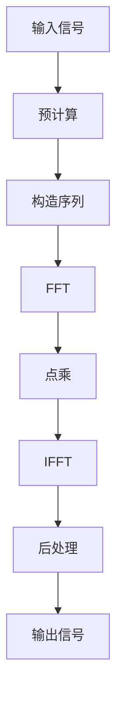

# MY_CZT_CONFIG 模块设计文档

## 1. 概述

本设计文档描述了MY_CZT_CONFIG模块的实现计划，该模块用于实现Chirp Z-Transform（CZT）算法，以在复平面上任意螺旋线上的采样点计算Z变换。CZT是一种通用的频谱分析方法，可以计算Z变换在复平面上任意路径上的采样值，而不仅仅是单位圆上的均匀采样（如FFT）。

## 2. CZT算法原理

### 2.1 基本原理

Chirp Z-Transform (CZT) 是一种通用的频谱分析方法，它可以计算Z变换在复平面上任意螺旋线上的采样值。CZT的基本思想是将Z变换的计算转换为卷积运算，然后利用FFT来高效计算卷积。

### 2.2 数学原理

Z变换定义：
```
X(z) = Σ(n=0 to N-1) x(n) * z^(-n)
```

CZT计算M个点的Z变换：
```
X(z_k) = Σ(n=0 to N-1) x(n) * z_k^(-n)
```

其中 z_k = A * W^(-k)，k = 0, 1, ..., M-1
- A = R0 * exp(j*φ0) 是起始点
- W = R * exp(j*φ) 是复数旋转因子

通过代数变换，可以将CZT表示为卷积形式：
```
X(z_k) = W^(k^2/2) * Σ(n=0 to N-1) [x(n) * W^(n^2/2)] * W^[-(n-k)^2/2]
```

这个卷积可以通过FFT高效计算。

### 2.3 技术优势

1. **灵活性**：可以计算任意路径上的Z变换采样值
2. **精度**：可以对感兴趣的频段进行高分辨率分析
3. **效率**：在某些情况下，CZT可能比FFT更高效，特别是在需要计算少量频点或非均匀频点时
4. **通用性**：CZT是FFT的通用化，FFT是CZT的一个特例

## 3. 配置参数设计

### 3.1 核心参数

以下参数需要在 `my_czt_config.h` 中定义：

```c
// --- 核心参数 ---
/** @brief 输入序列长度 */
#define CZT_N                   1024

/** @brief 输出点数 */
#define CZT_M                   1024

/** @brief 起始点的幅度 R0 */
#define CZT_R0                  1.0f

/** @brief 起始点的相位 φ0 (弧度) */
#define CZT_PHI0                0.0f

/** @brief 复数旋转因子的幅度 R */
#define CZT_R                   1.0f

/** @brief 复数旋转因子的相位 φ (弧度) */
#define CZT_PHI                 (2.0f * M_PI / CZT_M)

/** @brief 起始点 A = R0 * exp(j*φ0) */
#define CZT_A_REAL              (CZT_R0 * arm_cos_f32(CZT_PHI0))
#define CZT_A_IMAG              (CZT_R0 * arm_sin_f32(CZT_PHI0))

/** @brief 复数旋转因子 W = R * exp(j*φ) */
#define CZT_W_REAL              (CZT_R * arm_cos_f32(CZT_PHI))
#define CZT_W_IMAG              (CZT_R * arm_sin_f32(CZT_PHI))
```

## 4. 数据结构设计

### 4.1 信号缓冲区

在 `my_czt_config.c` 中定义以下信号缓冲区：

```c
// --- 信号缓冲区 ---
// 输入信号 (实数)
static float32_t signal_in[CZT_N];

// 输入信号 (复数)
static float32_t signal_in_real[CZT_N];
static float32_t signal_in_imag[CZT_N];

// 输出信号 (复数)
static float32_t signal_out_real[CZT_M];
static float32_t signal_out_imag[CZT_M];

// Chirp序列
static float32_t chirp_sequence_real[CZT_N + CZT_M - 1];
static float32_t chirp_sequence_imag[CZT_N + CZT_M - 1];

// Chirp序列的逆
static float32_t chirp_sequence_inv_real[CZT_M];
static float32_t chirp_sequence_inv_imag[CZT_M];

// 中间结果
static float32_t intermediate_real[CZT_N + CZT_M - 1];
static float32_t intermediate_imag[CZT_N + CZT_M - 1];
```

### 4.2 FFT实例

```c
// --- FFT实例 ---
static arm_cfft_instance_f32 cfft_inst;
```

## 5. 函数API接口设计

### 5.1 初始化函数

```c
/**
 * @brief 初始化CZT模块
 * @details 初始化FFT实例和相关参数
 * @return 0表示成功，其他值表示失败
 */
int my_czt_init(void);
```

### 5.2 CZT处理函数

```c
/**
 * @brief 执行CZT核心处理流程
 * @details 包括预计算、卷积计算等步骤
 * @param[in] input_real 输入信号实部数组
 * @param[in] input_imag 输入信号虚部数组
 * @param[out] output_real 输出信号实部数组
 * @param[out] output_imag 输出信号虚部数组
 * @return 0表示成功，其他值表示失败
 */
int my_czt_process(const float32_t* input_real, const float32_t* input_imag, 
                   float32_t* output_real, float32_t* output_imag);
```

### 5.3 辅助函数

```c
/**
 * @brief 获取输入信号
 * @param[out] buffer_real 实部缓冲区
 * @param[out] buffer_imag 虚部缓冲区
 * @param[in] length 缓冲区长度
 */
void my_czt_get_input_signal(float32_t* buffer_real, float32_t* buffer_imag, size_t length);

/**
 * @brief 获取输出信号
 * @param[out] buffer_real 实部缓冲区
 * @param[out] buffer_imag 虚部缓冲区
 * @param[in] length 缓冲区长度
 */
void my_czt_get_output_signal(float32_t* buffer_real, float32_t* buffer_imag, size_t length);
```

## 6. 处理流程与数据流动

CZT模块的数据处理流程如下图所示，展示了数据在各个处理阶段的流动：



### 6.1 数据流动详细说明

1. **输入信号获取**：
   - 获取输入信号的实部和虚部
   - 数据存储在`signal_in_real`和`signal_in_imag`缓冲区中

2. **预计算阶段**：
   - 计算 chirp 序列：W^(n^2/2) for n = 0, 1, ..., N+M-2
   - 计算 chirp 序列的逆：W^(-k^2/2) for k = 0, 1, ..., M-1

3. **构造序列阶段**：
   - 构造序列：y(n) = x(n) * W^(n^2/2) for n = 0, 1, ..., N-1
   - 构造滤波器序列：h(n) = W^(-n^2/2) for n = -(M-1), ..., N-1

4. **FFT阶段**：
   - 对构造的序列进行FFT变换

5. **点乘阶段**：
   - 对FFT结果进行点乘运算

6. **IFFT阶段**：
   - 对点乘结果进行IFFT变换

7. **后处理阶段**：
   - 提取结果并乘以 W^(k^2/2) 得到最终的CZT结果

8. **结果输出**：
   - 通过API函数输出最终的复数结果

## 7. 错误处理

定义以下错误码：

```c
typedef enum {
    MY_CZT_SUCCESS = 0,
    MY_CZT_ERROR_INVALID_PARAMETER,
    MY_CZT_ERROR_INIT_FAILED,
    MY_CZT_ERROR_PROCESS_FAILED,
    MY_CZT_ERROR_MEMORY_ALLOCATION
} my_czt_error_t;
```

## 8. 实现步骤

在 `my_czt_config.c` 中按以下步骤实现：

### 8.1 实现 `my_czt_init` 函数

```c
/**
 * @brief 初始化CZT模块
 * @details 初始化FFT实例和相关参数
 * @return 0表示成功，其他值表示失败
 */
int my_czt_init(void)
{
    // 初始化FFT实例
    arm_status status = arm_cfft_init_f32(&cfft_inst, CZT_N + CZT_M - 1);
    if (status != ARM_MATH_SUCCESS) {
        return MY_CZT_ERROR_INIT_FAILED;
    }
    
    // 预计算chirp序列
    // 这里需要实现chirp序列的计算
    
    return MY_CZT_SUCCESS;
}
```

### 8.2 实现 `my_czt_process` 函数

```c
/**
 * @brief 执行CZT核心处理流程
 * @details 包括预计算、卷积计算等步骤
 * @param[in] input_real 输入信号实部数组
 * @param[in] input_imag 输入信号虚部数组
 * @param[out] output_real 输出信号实部数组
 * @param[out] output_imag 输出信号虚部数组
 * @return 0表示成功，其他值表示失败
 */
int my_czt_process(const float32_t* input_real, const float32_t* input_imag, 
                   float32_t* output_real, float32_t* output_imag)
{
    // 检查输入参数
    if (input_real == NULL || input_imag == NULL || 
        output_real == NULL || output_imag == NULL) {
        return MY_CZT_ERROR_INVALID_PARAMETER;
    }
    
    // 1. 将输入信号复制到内部缓冲区
    memcpy(signal_in_real, input_real, sizeof(float32_t) * CZT_N);
    memcpy(signal_in_imag, input_imag, sizeof(float32_t) * CZT_N);
    
    // 2. 构造序列 y(n) = x(n) * W^(n^2/2)
    // 这里需要实现序列构造
    
    // 3. FFT变换
    arm_cfft_f32(&cfft_inst, intermediate_real, 0, 1);  // 正向FFT
    
    // 4. 点乘运算
    // 这里需要实现点乘运算
    
    // 5. IFFT变换
    arm_cfft_f32(&cfft_inst, intermediate_real, 1, 1);  // 反向FFT
    
    // 6. 后处理并提取结果
    // 这里需要实现后处理和结果提取
    
    // 7. 将结果复制到输出缓冲区
    memcpy(output_real, signal_out_real, sizeof(float32_t) * CZT_M);
    memcpy(output_imag, signal_out_imag, sizeof(float32_t) * CZT_M);
    
    return MY_CZT_SUCCESS;
}
```

### 8.3 实现辅助函数

```c
/**
 * @brief 获取输入信号
 * @param[out] buffer_real 实部缓冲区
 * @param[out] buffer_imag 虚部缓冲区
 * @param[in] length 缓冲区长度
 */
void my_czt_get_input_signal(float32_t* buffer_real, float32_t* buffer_imag, size_t length)
{
    // 检查输入参数
    if (buffer_real == NULL || buffer_imag == NULL || length > CZT_N) {
        return;
    }
    // 复制数据到输出缓冲区
    memcpy(buffer_real, signal_in_real, sizeof(float32_t) * length);
    memcpy(buffer_imag, signal_in_imag, sizeof(float32_t) * length);
}

/**
 * @brief 获取输出信号
 * @param[out] buffer_real 实部缓冲区
 * @param[out] buffer_imag 虚部缓冲区
 * @param[in] length 缓冲区长度
 */
void my_czt_get_output_signal(float32_t* buffer_real, float32_t* buffer_imag, size_t length)
{
    // 检查输入参数
    if (buffer_real == NULL || buffer_imag == NULL || length > CZT_M) {
        return;
    }
    // 复制数据到输出缓冲区
    memcpy(buffer_real, signal_out_real, sizeof(float32_t) * length);
    memcpy(buffer_imag, signal_out_imag, sizeof(float32_t) * length);
}
```

## 9. 性能分析

### 9.1 时间复杂度

CZT算法的时间复杂度为O((N+M) log(N+M))，其中N是输入序列长度，M是输出点数。这与FFT的时间复杂度相似。

### 9.2 空间复杂度

CZT算法的空间复杂度为O(N+M)，需要存储输入序列、chirp序列和中间结果。

### 9.3 计算效率

在某些情况下，CZT可能比FFT更高效，特别是在需要计算少量频点或非均匀频点时。

### 9.4 数值稳定性

CZT的数值稳定性与FFT相当，但在某些参数设置下可能会有数值误差累积。

## 10. 应用场景

### 10.1 窄带频谱分析

当只需要分析信号的特定频段时，CZT可以提供高分辨率的频谱分析。

### 10.2 非均匀频率采样

在某些应用中，可能需要在非均匀分布的频率点上计算频谱。

### 10.3 高分辨率频谱分析

CZT可以用于计算任意数量的频率点，从而实现高分辨率频谱分析。

### 10.4 雷达信号处理

在雷达系统中，CZT可以用于处理特定频段的回波信号。

### 10.5 通信系统

在通信系统中，CZT可以用于分析特定信道的频率响应。

### 10.6 生物医学信号处理

在生物医学信号处理中，CZT可以用于分析特定频段的生理信号。

## 11. 接口定义

### 11.1 头文件定义

```c
// my_czt_config.h

#ifndef MY_CZT_CONFIG_H
#define MY_CZT_CONFIG_H

#include "arm_math.h"

// --- 核心参数 ---
/** @brief 输入序列长度 */
#define CZT_N                   1024

/** @brief 输出点数 */
#define CZT_M                   1024

/** @brief 起始点的幅度 R0 */
#define CZT_R0                  1.0f

/** @brief 起始点的相位 φ0 (弧度) */
#define CZT_PHI0                0.0f

/** @brief 复数旋转因子的幅度 R */
#define CZT_R                   1.0f

/** @brief 复数旋转因子的相位 φ (弧度) */
#define CZT_PHI                 (2.0f * M_PI / CZT_M)

/** @brief 起始点 A = R0 * exp(j*φ0) */
#define CZT_A_REAL              (CZT_R0 * arm_cos_f32(CZT_PHI0))
#define CZT_A_IMAG              (CZT_R0 * arm_sin_f32(CZT_PHI0))

/** @brief 复数旋转因子 W = R * exp(j*φ) */
#define CZT_W_REAL              (CZT_R * arm_cos_f32(CZT_PHI))
#define CZT_W_IMAG              (CZT_R * arm_sin_f32(CZT_PHI))

// --- 错误码定义 ---
typedef enum {
    MY_CZT_SUCCESS = 0,
    MY_CZT_ERROR_INVALID_PARAMETER,
    MY_CZT_ERROR_INIT_FAILED,
    MY_CZT_ERROR_PROCESS_FAILED,
    MY_CZT_ERROR_MEMORY_ALLOCATION
} my_czt_error_t;

// --- 函数声明 ---
/**
 * @brief 初始化CZT模块
 * @details 初始化FFT实例和相关参数
 * @return 0表示成功，其他值表示失败
 */
int my_czt_init(void);

/**
 * @brief 执行CZT核心处理流程
 * @details 包括预计算、卷积计算等步骤
 * @param[in] input_real 输入信号实部数组
 * @param[in] input_imag 输入信号虚部数组
 * @param[out] output_real 输出信号实部数组
 * @param[out] output_imag 输出信号虚部数组
 * @return 0表示成功，其他值表示失败
 */
int my_czt_process(const float32_t* input_real, const float32_t* input_imag, 
                   float32_t* output_real, float32_t* output_imag);

/**
 * @brief 获取输入信号
 * @param[out] buffer_real 实部缓冲区
 * @param[out] buffer_imag 虚部缓冲区
 * @param[in] length 缓冲区长度
 */
void my_czt_get_input_signal(float32_t* buffer_real, float32_t* buffer_imag, size_t length);

/**
 * @brief 获取输出信号
 * @param[out] buffer_real 实部缓冲区
 * @param[out] buffer_imag 虚部缓冲区
 * @param[in] length 缓冲区长度
 */
void my_czt_get_output_signal(float32_t* buffer_real, float32_t* buffer_imag, size_t length);

#endif // MY_CZT_CONFIG_H
```

## 12. 测试验证

### 12.1 功能测试

1. 验证CZT算法能够正确计算Z变换在复平面上任意螺旋线上的采样值
2. 验证CZT算法在不同参数设置下的正确性
3. 验证CZT算法与FFT在单位圆上均匀采样点的一致性

### 12.2 性能测试

1. 测试CZT算法在不同输入序列长度和输出点数下的执行时间
2. 测试CZT算法的内存使用情况
3. 测试CZT算法在不同硬件平台上的性能表现

### 12.3 精度测试

1. 测试CZT算法的数值精度
2. 验证CZT算法在边界条件下的精度表现
3. 比较CZT算法与理论值的误差

### 12.4 稳定性测试

1. 测试CZT算法在长时间运行下的稳定性
2. 验证CZT算法在异常输入下的容错能力