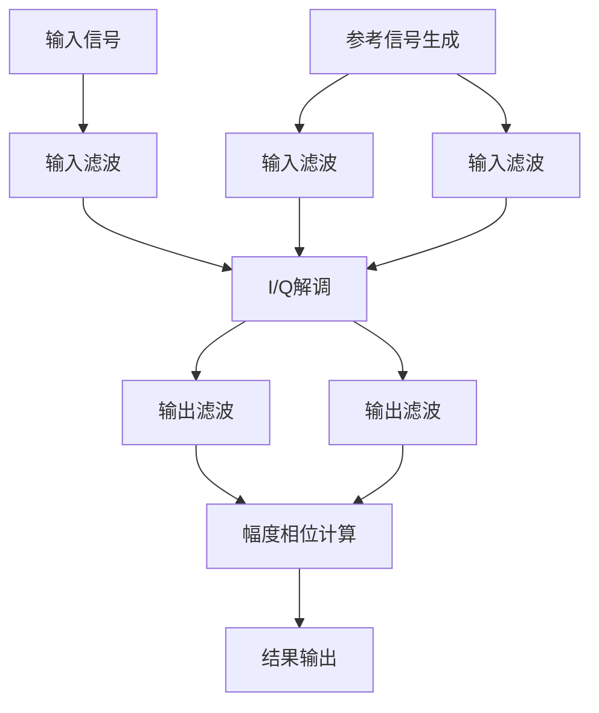

# MY_DILA_CONFIG 模块设计文档

## 1. 概述

本设计文档描述了MY_DILA_CONFIG模块的实现计划，该模块用于实现数字锁相放大器(DILA)算法，以从输入信号中提取幅度和相位信息。

## 2. DILA算法原理

数字锁相放大器(Digital Lock-In Amplifier, DILA)是一种用于从噪声中提取微弱信号的精密测量技术。它基于相干检测原理，能够有效地从强噪声背景中提取出已知频率的微弱信号。

### 2.1 基本原理

DILA的核心思想是利用参考信号与输入信号进行相关运算，从而提取出与参考信号同频同相的信号分量。其工作原理如下：

1. **参考信号生成**：生成与待测信号频率相同的正弦和余弦参考信号
2. **信号解调**：将输入信号分别与正弦和余弦参考信号相乘
3. **低通滤波**：通过低通滤波器滤除高频分量，保留直流分量
4. **幅度相位计算**：根据解调后的直流分量计算信号的幅度和相位

### 2.2 数学原理

假设输入信号为：
```
s(t) = A * cos(ωt + φ) + n(t)
```

其中：
- A是信号幅度
- ω是信号角频率
- φ是信号相位
- n(t)是噪声

参考信号为：
```
ref_I(t) = cos(ωt)
ref_Q(t) = sin(ωt)
```

解调过程为：
```
I(t) = s(t) * ref_I(t) = A * cos(ωt + φ) * cos(ωt) + n(t) * cos(ωt)
Q(t) = s(t) * ref_Q(t) = A * cos(ωt + φ) * sin(ωt) + n(t) * sin(ωt)
```

经过三角恒等式变换和低通滤波后，得到：
```
I_dc = (A/2) * cos(φ)
Q_dc = (A/2) * sin(φ)
```

最终的幅度和相位为：
```
A = 2 * sqrt(I_dc² + Q_dc²)
φ = atan2(Q_dc, I_dc)
```

### 2.3 技术优势

1. **高信噪比**：通过相关检测，可以有效抑制噪声
2. **频率选择性**：只对特定频率的信号敏感
3. **相位信息**：不仅能测量幅度，还能测量相位
4. **数字实现**：具有更高的稳定性和可重复性

## 3. 配置参数设计

### 3.1 核心参数

以下参数需要在 `my_dila_config.h` 中定义：

```c
// --- 核心参数 ---
/** @brief ADC采样频率 (Hz) */
#define DILA_FS                  400000.0f

/** @brief 期望的输入信号频率 (Hz) */
#define DILA_FIN_DESIRED         20000.0f

/** @brief ADC采集点数 / 处理的数据块大小 */
#define DILA_N                   4096

/** @brief 实际使用的输入信号频率 */
#define DILA_FIN_ACTUAL          20000.0f

// --- 真实信号参数 (用于生成测试信号) ---
/** @brief 测试信号的幅度 (V) */
#define DILA_AIN                 1.0f

/** @brief 测试信号的初始相位 (度) */
#define DILA_PHI_IN_DEG          45.0f

/** @brief 测试信号的初始相位 (弧度) */
#define DILA_PHI_IN_RAD          (DILA_PHI_IN_DEG * M_PI / 180.0f)

/** @brief 测试信号的噪声幅度 */
#define DILA_NOISE_AMP           0.01f
```

### 3.2 FIR滤波器参数

```c
// --- FIR滤波器参数 ---
/** @brief 整个DILA处理流程的总延迟（样本数），用于截取稳态信号 */
#define DILA_TOTAL_DELAY    37

/** @brief 输入FIR滤波器的抽头数 */
#define INPUT_FIR_NUM_TAPS    10

/** @brief 输出FIR滤波器的抽头数 */
#define OUTPUT_FIR_NUM_TAPS    65
```

## 4. 数据结构设计

### 4.1 信号缓冲区

在 `my_dila_config.c` 中定义以下信号缓冲区：

```c
// --- 信号缓冲区 ---
// 输入信号
static float32_t signal_in[DILA_N];

// 理想参考信号
static float32_t ref_I_ideal[DILA_N];
static float32_t ref_Q_ideal[DILA_N];

// 滤波后的信号
static float32_t signal_filtered[DILA_N];
static float32_t ref_I_filtered[DILA_N];
static float32_t ref_Q_filtered[DILA_N];

// 解调后的I/Q信号 (混频后)
static float32_t I_raw[DILA_N];
static float32_t Q_raw[DILA_N];

// 最终滤波后的I/Q信号 (直流分量)
static float32_t I_filtered[DILA_N];
static float32_t Q_filtered[DILA_N];
```

### 4.2 FIR滤波器实例

```c
// --- FIR滤波器实例 ---
// 输入滤波器实例 (信号, I参考, Q参考 共用相同的系数)
static arm_fir_instance_f32 fir_inst_input_signal;
static arm_fir_instance_f32 fir_inst_input_ref_i;
static arm_fir_instance_f32 fir_inst_input_ref_q;

// 输出滤波器实例 (I通道, Q通道 共用相同的系数)
static arm_fir_instance_f32 fir_inst_output_i;
static arm_fir_instance_f32 fir_inst_output_q;
```

### 4.3 FIR滤波器状态缓冲区

```c
// --- FIR滤波器状态缓冲区 ---
// 状态缓冲区大小为 (抽头数 + 块大小 - 1)
#define INPUT_FIR_STATE_SIZE  (INPUT_FIR_NUM_TAPS + DILA_N - 1)
#define OUTPUT_FIR_STATE_SIZE (OUTPUT_FIR_NUM_TAPS + DILA_N - 1)

static float32_t fir_state_input_signal[INPUT_FIR_STATE_SIZE];
static float32_t fir_state_input_ref_i[INPUT_FIR_STATE_SIZE];
static float32_t fir_state_input_ref_q[INPUT_FIR_STATE_SIZE];
static float32_t fir_state_output_i[OUTPUT_FIR_STATE_SIZE];
static float32_t fir_state_output_q[OUTPUT_FIR_STATE_SIZE];
```

## 5. 函数API接口设计

### 5.1 初始化函数

```c
/**
 * @brief 初始化DILA模块
 * @details 初始化FIR滤波器实例和相关参数
 * @param[in] input_fir_coeffs 输入FIR滤波器系数数组
 * @param[in] output_fir_coeffs 输出FIR滤波器系数数组
 * @return 0表示成功，其他值表示失败
 */
int my_dila_init(const float32_t* input_fir_coeffs, const float32_t* output_fir_coeffs);
```

### 5.2 信号处理函数

```c
/**
 * @brief 生成理想参考信号
 * @details 根据配置参数生成正交的正弦和余弦参考信号
 */
void my_dila_generate_reference_signals(void);

/**
 * @brief 执行DILA核心处理流程
 * @details 包括输入滤波、IQ解调、输出滤波等步骤
 * @param[in] input_signal 输入信号数组
 */
void my_dila_process_signal(const float32_t* input_signal);

/**
 * @brief 计算幅度和相位结果
 * @details 从滤波后的I/Q信号中计算幅度和相位
 * @param[out] magnitude 输出幅度值
 * @param[out] phase 输出相位值(弧度)
 * @param[out] phase_deg 输出相位值(度)
 */
void my_dila_calculate_results(float32_t* magnitude, float32_t* phase, float32_t* phase_deg);
```

### 5.3 辅助函数

```c
/**
 * @brief 获取I通道滤波后的信号
 * @param[out] buffer 输出缓冲区
 * @param[in] length 缓冲区长度
 */
void my_dila_get_I_filtered(float32_t* buffer, size_t length);

/**
 * @brief 获取Q通道滤波后的信号
 * @param[out] buffer 输出缓冲区
 * @param[in] length 缓冲区长度
 */
void my_dila_get_Q_filtered(float32_t* buffer, size_t length);
```

## 6. 处理流程与数据流动

DILA模块的数据处理流程如下图所示，展示了数据在各个处理阶段的流动：



### 6.1 数据流动详细说明

1. **输入信号获取**：
   - 从ADC模块获取采样数据
   - 数据存储在`signal_in`缓冲区中

2. **参考信号生成**：
   - 根据配置参数生成正交的正弦和余弦参考信号
   - 正弦参考信号存储在`ref_I_ideal`缓冲区中
   - 余弦参考信号存储在`ref_Q_ideal`缓冲区中

3. **输入滤波阶段**：
   - 输入信号通过输入FIR滤波器处理，结果存储在`signal_filtered`缓冲区中
   - 正弦参考信号通过输入FIR滤波器处理，结果存储在`ref_I_filtered`缓冲区中
   - 余弦参考信号通过输入FIR滤波器处理，结果存储在`ref_Q_filtered`缓冲区中

4. **I/Q解调阶段**：
   - 输入信号与正弦参考信号相乘，结果存储在`I_raw`缓冲区中
   - 输入信号与余弦参考信号相乘，结果存储在`Q_raw`缓冲区中

5. **输出滤波阶段**：
   - I_raw信号通过输出FIR滤波器处理，结果存储在`I_filtered`缓冲区中
   - Q_raw信号通过输出FIR滤波器处理，结果存储在`Q_filtered`缓冲区中

6. **幅度相位计算阶段**：
   - 从`I_filtered`和`Q_filtered`缓冲区中提取稳态数据
   - 计算直流分量并得出幅度和相位结果

7. **结果输出**：
   - 通过API函数输出最终的幅度和相位结果

## 7. 与ADC模块的集成

DILA模块需要与ADC模块集成，以获取实际的输入信号。集成方式如下：

1. ADC模块通过DMA将采样数据存储到缓冲区
2. 当缓冲区填满时，ADC模块调用DILA模块的处理函数
3. DILA模块处理完数据后，将结果存储在内部缓冲区或通过回调函数通知上层应用

## 8. 错误处理

定义以下错误码：

```c
typedef enum {
    MY_DILA_SUCCESS = 0,
    MY_DILA_ERROR_INVALID_PARAMETER,
    MY_DILA_ERROR_INIT_FAILED,
    MY_DILA_ERROR_PROCESS_FAILED
} my_dila_error_t;
```

## 9. 实现步骤

在 `my_dila_config.c` 中按以下步骤实现：

### 9.1 实现 `my_dila_init` 函数

```c
/**
 * @brief 初始化DILA模块
 * @details 初始化FIR滤波器实例和相关参数
 * @param[in] input_fir_coeffs 输入FIR滤波器系数数组
 * @param[in] output_fir_coeffs 输出FIR滤波器系数数组
 * @return 0表示成功，其他值表示失败
 */
int my_dila_init(const float32_t* input_fir_coeffs, const float32_t* output_fir_coeffs)
{
    // 检查输入参数
    if (input_fir_coeffs == NULL || output_fir_coeffs == NULL) {
        return MY_DILA_ERROR_INVALID_PARAMETER;
    }
    
    // 初始化输入FIR滤波器
    arm_fir_init_f32(&fir_inst_input_signal, INPUT_FIR_NUM_TAPS, (float32_t*)input_fir_coeffs, fir_state_input_signal, DILA_N);
    arm_fir_init_f32(&fir_inst_input_ref_i, INPUT_FIR_NUM_TAPS, (float32_t*)input_fir_coeffs, fir_state_input_ref_i, DILA_N);
    arm_fir_init_f32(&fir_inst_input_ref_q, INPUT_FIR_NUM_TAPS, (float32_t*)input_fir_coeffs, fir_state_input_ref_q, DILA_N);
    
    // 初始化输出FIR滤波器
    arm_fir_init_f32(&fir_inst_output_i, OUTPUT_FIR_NUM_TAPS, (float32_t*)output_fir_coeffs, fir_state_output_i, DILA_N);
    arm_fir_init_f32(&fir_inst_output_q, OUTPUT_FIR_NUM_TAPS, (float32_t*)output_fir_coeffs, fir_state_output_q, DILA_N);
    
    return MY_DILA_SUCCESS;
}
```

### 9.2 实现 `my_dila_generate_reference_signals` 函数

```c
/**
 * @brief 生成理想参考信号
 * @details 根据配置参数生成正交的正弦和余弦参考信号
 */
void my_dila_generate_reference_signals(void)
{
    // 计算时间步长
    float32_t dt = 1.0f / DILA_FS;
    
    // 生成正交的正弦和余弦参考信号
    for(uint16_t i = 0; i < DILA_N; i++)
    {
        float32_t t = i * dt;
        ref_I_ideal[i] = arm_sin_f32(2 * M_PI * DILA_FIN_ACTUAL * t);
        ref_Q_ideal[i] = arm_cos_f32(2 * M_PI * DILA_FIN_ACTUAL * t);
    }
}
```

### 9.3 实现 `my_dila_process_signal` 函数

```c
/**
 * @brief 执行DILA核心处理流程
 * @details 包括输入滤波、IQ解调、输出滤波等步骤
 * @param[in] input_signal 输入信号数组
 */
void my_dila_process_signal(const float32_t* input_signal)
{
    // 1. 将输入信号复制到内部缓冲区
    // 这一步是为了确保输入信号不会在处理过程中被修改
    memcpy(signal_in, input_signal, sizeof(float32_t) * DILA_N);
    
    // 2. 输入滤波: 信号和参考信号通过完全相同的输入滤波器
    // 这一步是为了匹配输入信号和参考信号的相位响应
    arm_fir_f32(&fir_inst_input_signal, signal_in, signal_filtered, DILA_N);
    arm_fir_f32(&fir_inst_input_ref_i, ref_I_ideal, ref_I_filtered, DILA_N);
    arm_fir_f32(&fir_inst_input_ref_q, ref_Q_ideal, ref_Q_filtered, DILA_N);
    
    // 3. I/Q解调 (使用滤波后的参考信号)
    // 将输入信号与正交参考信号相乘，得到I/Q分量
    arm_mult_f32(signal_filtered, ref_I_filtered, I_raw, DILA_N);
    arm_mult_f32(signal_filtered, ref_Q_filtered, Q_raw, DILA_N);
    
    // 4. 输出滤波 (滤除2*Fin分量)
    // 使用窄带滤波器滤除高频分量，保留直流分量
    arm_fir_f32(&fir_inst_output_i, I_raw, I_filtered, DILA_N);
    arm_fir_f32(&fir_inst_output_q, Q_raw, Q_filtered, DILA_N);
}
```

### 9.4 实现 `my_dila_calculate_results` 函数

```c
/**
 * @brief 计算幅度和相位结果
 * @details 从滤波后的I/Q信号中计算幅度和相位
 * @param[out] magnitude 输出幅度值
 * @param[out] phase 输出相位值(弧度)
 * @param[out] phase_deg 输出相位值(度)
 */
void my_dila_calculate_results(float32_t* magnitude, float32_t* phase, float32_t* phase_deg)
{
    float32_t I_dc, Q_dc;
    
    // 1. 计算均值
    // 丢弃瞬态部分，仅对稳态部分求均值
    uint16_t start_idx = DILA_TOTAL_DELAY;
    uint32_t steady_state_len = DILA_N - start_idx;
    
    // 检查稳态长度是否有效
    if (steady_state_len <= 0)
    {
        // 错误处理
        return;
    }
    
    // 计算I/Q通道的直流分量
    arm_mean_f32(&I_filtered[start_idx], steady_state_len, &I_dc);
    arm_mean_f32(&Q_filtered[start_idx], steady_state_len, &Q_dc);
    
    // 2. 幅度计算
    // R_meas = 2 * sqrt(I_dc^2 + Q_dc^2)
    float32_t temp_sqrt_arg = I_dc * I_dc + Q_dc * Q_dc;
    arm_sqrt_f32(temp_sqrt_arg, magnitude);
    *magnitude *= 2.0f;
    
    // 3. 相位计算
    // 使用atan2f函数计算相位，范围为(-π, π]
    *phase = atan2f(Q_dc, I_dc);
    *phase_deg = *phase * 180.0f / M_PI;
}
```

### 9.5 实现辅助函数

```c
/**
 * @brief 获取I通道滤波后的信号
 * @param[out] buffer 输出缓冲区
 * @param[in] length 缓冲区长度
 */
void my_dila_get_I_filtered(float32_t* buffer, size_t length)
{
    // 检查输入参数
    if (buffer == NULL || length > DILA_N) {
        return;
    }
    // 复制数据到输出缓冲区
    memcpy(buffer, I_filtered, sizeof(float32_t) * length);
}

/**
 * @brief 获取Q通道滤波后的信号
 * @param[out] buffer 输出缓冲区
 * @param[in] length 缓冲区长度
 */
void my_dila_get_Q_filtered(float32_t* buffer, size_t length)
{
    // 检查输入参数
    if (buffer == NULL || length > DILA_N) {
        return;
    }
    // 复制数据到输出缓冲区
    memcpy(buffer, Q_filtered, sizeof(float32_t) * length);
}
```

## 10. 输入信号处理说明

输入信号处理是DILA算法的第一步，主要涉及以下几个方面：

1. **信号获取**：从ADC模块获取采样数据
2. **数据预处理**：将ADC数据转换为浮点数格式
3. **信号完整性检查**：验证数据是否完整且符合预期格式

在实际应用中，输入信号通常通过ADC模块以DMA方式采集，并存储在缓冲区中。当缓冲区填满时，ADC模块会触发中断或回调函数，通知DILA模块开始处理数据。

## 11. 参考信号生成说明

参考信号生成是DILA算法的关键步骤之一，它决定了算法的性能。参考信号需要满足以下要求：

1. **正交性**：I路和Q路参考信号需要正交（相位差90度）
2. **频率匹配**：参考信号频率需要与输入信号频率严格匹配
3. **相位精度**：参考信号的相位需要高精度，以确保解调的准确性

在本实现中，参考信号通过以下方式生成：
1. 根据配置的信号频率和采样率计算时间步长
2. 使用ARM CMSIS-DSP库的正弦和余弦函数生成正交信号
3. 生成的参考信号存储在内部缓冲区中，供后续处理使用

## 12. FIR滤波器设计说明

FIR滤波器在DILA算法中起着至关重要的作用，主要用于两个阶段：

1. **输入滤波**：匹配输入信号和参考信号的相位响应
2. **输出滤波**：滤除高频分量，保留直流分量

### 12.1 输入FIR滤波器

输入FIR滤波器的主要作用是：
1. 匹配输入信号和参考信号的相位响应，确保解调的准确性
2. 滤除带外噪声，提高信噪比

设计要求：
- 抽头数：10
- 通带频率：与输入信号频率匹配
- 群延迟：需要在设计时计算并记录

### 12.2 输出FIR滤波器

输出FIR滤波器的主要作用是：
1. 滤除解调后产生的2*Fin高频分量
2. 保留直流分量（即所需的幅度和相位信息）

设计要求：
- 抽头数：65
- 通带频率：直流附近
- 阻带频率：远离直流
- 群延迟：需要在设计时计算并记录

### 12.3 FIR滤波器初始化

FIR滤波器初始化需要以下步骤：
1. 创建滤波器实例（arm_fir_instance_f32）
2. 分配状态缓冲区
3. 调用arm_fir_init_f32函数初始化滤波器

### 12.4 FIR滤波器处理

FIR滤波器处理通过调用arm_fir_f32函数实现：
1. 输入信号作为输入
2. 滤波后的信号作为输出
3. 处理长度为DILA_N

## 13. IQ解调和输出滤波说明

### 13.1 IQ解调原理

IQ解调是通过将输入信号与正交参考信号相乘实现的：
1. I通道：输入信号 × 正弦参考信号
2. Q通道：输入信号 × 余弦参考信号

解调后的信号包含以下分量：
- 直流分量：包含幅度和相位信息
- 2*Fin分量：需要滤除的高频分量

### 13.2 输出滤波

输出滤波的作用是滤除2*Fin分量，保留直流分量：
1. 使用窄带滤波器实现
2. 滤波器设计需要考虑群延迟
3. 滤波后的信号用于幅度和相位计算

## 14. 幅度和相位计算说明

### 14.1 幅度计算原理

在IQ解调和输出滤波后，I/Q通道的信号主要包含直流分量，这些直流分量与输入信号的幅度和相位有关：

- I_dc = (A/2) * cos(φ)
- Q_dc = (A/2) * sin(φ)

其中：
- A是输入信号的幅度
- φ是输入信号的相位

因此，信号幅度可以通过以下公式计算：
- A = 2 * sqrt(I_dc² + Q_dc²)

### 14.2 相位计算原理

信号相位可以通过以下公式计算：
- φ = atan2(Q_dc, I_dc)

atan2函数的优势在于它能正确处理所有象限，并且返回值在(-π, π]范围内。

### 14.3 群延迟补偿

在计算幅度和相位时，需要考虑滤波器引入的群延迟。在本实现中：
1. 群延迟值在设计时已计算并记录在DILA_TOTAL_DELAY参数中
2. 计算时丢弃前DILA_TOTAL_DELAY个样本，仅对稳态部分求均值

### 14.4 误差分析

影响幅度和相位测量精度的因素包括：
1. **滤波器设计**：滤波器的频率响应和群延迟特性
2. **量化噪声**：ADC和数字处理中的量化误差
3. **参考信号精度**：参考信号的频率和相位精度
4. **噪声**：系统噪声对测量结果的影响

## 15. 结果输出机制

DILA模块提供多种方式输出结果：

### 15.1 直接函数调用

通过`my_dila_calculate_results`函数直接获取结果：

```c
float32_t magnitude, phase, phase_deg;
my_dila_calculate_results(&magnitude, &phase, &phase_deg);
// 使用结果...
```

### 15.2 通过辅助函数获取中间结果

通过辅助函数获取滤波后的I/Q信号：

```c
float32_t I_buffer[DILA_N], Q_buffer[DILA_N];
my_dila_get_I_filtered(I_buffer, DILA_N);
my_dila_get_Q_filtered(Q_buffer, DILA_N);
// 使用结果...
```

### 15.3 与上层应用的集成

DILA模块可以通过以下方式与上层应用集成：
1. **回调函数**：处理完成后调用回调函数通知上层应用
2. **轮询机制**：上层应用定期查询处理状态和结果
3. **中断机制**：处理完成后触发中断通知上层应用

## 16. 错误处理机制

DILA模块提供完善的错误处理机制，确保系统的稳定性和可靠性。

### 16.1 错误码定义

```c
typedef enum {
    MY_DILA_SUCCESS = 0,
    MY_DILA_ERROR_INVALID_PARAMETER,
    MY_DILA_ERROR_INIT_FAILED,
    MY_DILA_ERROR_PROCESS_FAILED
} my_dila_error_t;
```

### 16.2 错误处理策略

1. **参数验证**：在函数入口处验证输入参数的有效性
2. **初始化检查**：确保模块正确初始化后再进行处理
3. **运行时错误处理**：检测并处理运行时可能出现的错误
4. **错误日志记录**：记录错误信息，便于调试和维护

### 16.3 异常情况处理

1. **输入信号异常**：检测输入信号是否超出预期范围
2. **滤波器初始化失败**：检查滤波器初始化是否成功
3. **内存不足**：确保有足够的内存进行信号处理
4. **计算溢出**：检测计算过程中是否发生溢出