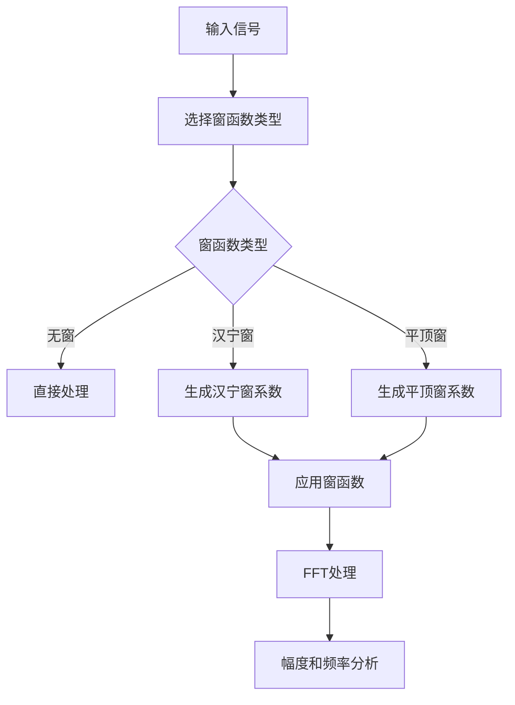

# 平顶窗功能设计文档

## 1. 概述

本设计文档描述了为Frequency模块添加平顶窗功能的实现方案。平顶窗是一种特殊的窗函数，具有极低的幅度波动特性，非常适合用于精确的幅度测量。

## 2. 平顶窗原理

### 2.1 基本原理

平顶窗是一种专门设计用于精确幅度测量的窗函数。与汉宁窗、汉明窗等相比，平顶窗具有以下特点：

1. **极低的幅度波动**：在主瓣范围内，幅度波动小于0.1dB
2. **良好的幅度测量精度**：适合用于精确的频谱幅度测量
3. **较宽的主瓣**：牺牲了频率分辨率以换取幅度精度

### 2.2 数学表达式

常用的平顶窗（ISO 18431-2标准）定义为：
```
w(n) = a0 - a1*cos(2πn/(N-1)) + a2*cos(4πn/(N-1)) - a3*cos(6πn/(N-1)) + a4*cos(8πn/(N-1))
```

其中系数为：
- a0 = 1.000000000000000
- a1 = 1.930000000000000
- a2 = 1.290000000000000
- a3 = 0.388000000000000
- a4 = 0.032000000000000

### 2.3 技术优势

1. **高幅度测量精度**：幅度测量误差小于0.1dB
2. **适用于校准**：常用于频谱分析仪的校准
3. **频率无关性**：在整个频率范围内具有稳定的幅度响应

## 3. 配置参数设计

### 3.1 窗函数类型枚举

在 `my_freq_config.h` 中添加新的窗函数类型枚举：

```c
// --- 窗函数类型定义 ---
typedef enum {
    WINDOW_NONE = 0,        // 无窗函数
    WINDOW_HANNING = 1,     // 汉宁窗
    WINDOW_FLAT_TOP = 2     // 平顶窗
} window_type_t;
```

## 4. 数据结构设计

### 4.1 窗函数系数数组

在 `my_freq_config.c` 中添加平顶窗系数数组：

```c
// --- 平顶窗系数 (ISO 18431-2标准) ---
float32_t g_flat_top_window[FFT_LENGTH]; // 平顶窗系数

// --- 平顶窗系数定义 ---
#define FLAT_TOP_A0 1.000000000000000f
#define FLAT_TOP_A1 1.930000000000000f
#define FLAT_TOP_A2 1.290000000000000f
#define FLAT_TOP_A3 0.388000000000000f
#define FLAT_TOP_A4 0.032000000000000f
```

### 4.2 窗函数补偿系数

```c
// --- 窗函数补偿系数 ---
#define HANNING_WINDOW_FACTOR 2.0f     // 汉宁窗补偿系数
#define FLAT_TOP_WINDOW_FACTOR 0.216f  // 平顶窗补偿系数
```

## 5. 函数API接口设计

### 5.1 窗函数生成函数

```c
/**
 * @brief 生成指定类型的窗函数
 * @param window_type 窗函数类型
 * @param window_buffer 窗函数系数存储缓冲区
 * @param length 窗函数长度
 * @return 窗函数的补偿系数
 */
float32_t generate_window(window_type_t window_type, float32_t* window_buffer, uint32_t length);
```

## 6. 处理流程与数据流动

### 6.1 数据处理流程



### 6.2 数据流动详细说明

1. **窗函数选择**：
   - 根据用户选择的窗函数类型确定使用的窗函数

2. **窗函数生成**：
   - 根据窗函数类型生成相应的窗函数系数
   - 计算窗函数的补偿系数

3. **窗函数应用**：
   - 将窗函数系数与输入信号逐点相乘

4. **后续处理**：
   - 继续进行FFT和频谱分析

## 7. 与现有系统的集成

### 7.1 接口修改

需要修改现有函数接口以支持窗函数选择：

```c
void my_armcfft32_apply(float32_t* adc_input, fundamental_result_t* result, 
                       uint8_t enable_fir, window_type_t window_type, 
                       spectral_interpolation_mode_t interpolation_mode);
                       
void my_armrfft32_apply(float32_t* adc_input, fundamental_result_t* result, 
                       uint8_t enable_fir, window_type_t window_type, 
                       spectral_interpolation_mode_t interpolation_mode);
```

### 7.2 向后兼容性

为了保持向后兼容性，可以添加一个包装函数：

```c
void my_armcfft32_apply_old(float32_t* adc_input, fundamental_result_t* result, 
                           uint8_t enable_fir, uint8_t enable_window, 
                           spectral_interpolation_mode_t interpolation_mode)
{
    window_type_t window_type = enable_window ? WINDOW_HANNING : WINDOW_NONE;
    my_armcfft32_apply(adc_input, result, enable_fir, window_type, interpolation_mode);
}
```

## 8. 错误处理

定义窗函数相关的错误码：

```c
typedef enum {
    WINDOW_SUCCESS = 0,
    WINDOW_ERROR_INVALID_PARAMETER,
    WINDOW_ERROR_UNSUPPORTED_TYPE
} window_error_t;
```

## 9. 实现步骤

### 9.1 修改头文件

在 `my_freq_config.h` 中添加窗函数类型定义和函数声明。

### 9.2 实现窗函数生成函数

在 `my_freq_config.c` 中实现 `generate_window` 函数。

### 9.3 修改现有处理函数

修改 `my_armcfft32_apply` 和 `my_armrfft32_apply` 函数以支持新的窗函数类型。

### 9.4 添加补偿系数计算

根据不同窗函数类型计算相应的补偿系数。

## 10. 测试验证方案

### 10.1 功能测试

1. 验证平顶窗系数生成的正确性
2. 验证不同窗函数类型下的幅度测量精度
3. 验证向后兼容性

### 10.2 性能测试

1. 测试不同窗函数的计算开销
2. 验证内存使用情况

### 10.3 精度测试

1. 比较不同窗函数下的幅度测量精度
2. 验证平顶窗在不同频率下的幅度稳定性

## 11. 使用说明

### 11.1 启用平顶窗

```c
// 使用平顶窗进行频谱分析
my_armcfft32_apply(adc_data, &result, 1, WINDOW_FLAT_TOP, INTERPOLATION_HANNING_SPECIAL);
```

### 11.2 选择不同窗函数

```c
// 不使用窗函数
my_armcfft32_apply(adc_data, &result, 1, WINDOW_NONE, INTERPOLATION_DISABLED);

// 使用汉宁窗
my_armcfft32_apply(adc_data, &result, 1, WINDOW_HANNING, INTERPOLATION_HANNING_SPECIAL);

// 使用平顶窗
my_armcfft32_apply(adc_data, &result, 1, WINDOW_FLAT_TOP, INTERPOLATION_HANNING_SPECIAL);
```

## 12. 注意事项

### 12.1 精度说明

1. 平顶窗适合幅度测量，但频率分辨率较低
2. 在选择窗函数时需要根据应用需求权衡精度和分辨率

### 12.2 性能影响

1. 不同窗函数的计算开销略有差异
2. 平顶窗的生成需要更多的三角函数计算

### 12.3 限制条件

1. 窗函数长度必须与FFT长度一致
2. 窗函数系数需要预先计算并存储在内存中