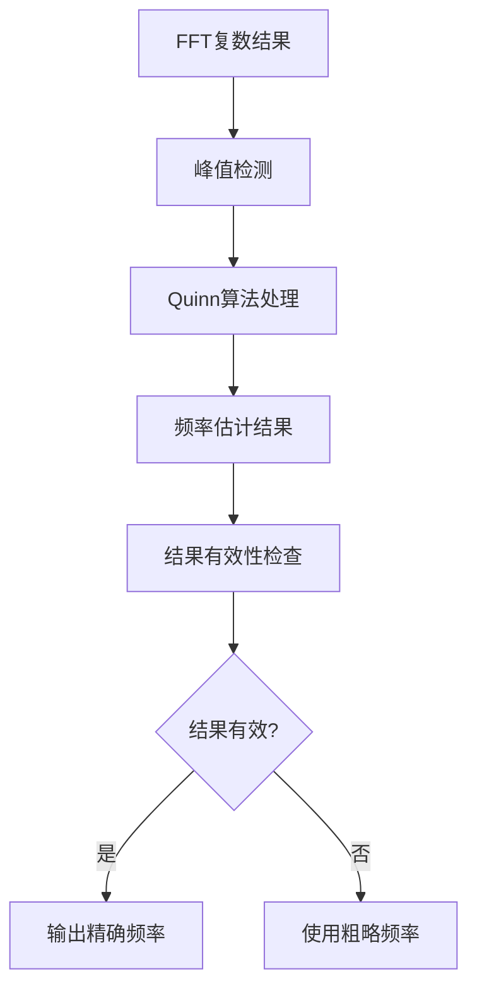

# MY_QUINN_CONFIG 模块设计文档

## 1. 概述

本设计文档描述了MY_QUINN_CONFIG模块的实现计划，该模块用于实现Quinn频率估计算法，以提高FFT频率估计的精度。Quinn算法是一种基于FFT峰值邻近点的频率估计方法，能够显著提高频率估计的精度。

## 2. Quinn算法原理

### 2.1 基本原理

Quinn频率估计算法是一种用于提高FFT频率估计精度的后处理技术。它基于FFT输出中峰值点及其相邻点的信息，通过数学推导来估计真实的频率值。

在FFT处理后，我们通常只能得到离散频率点上的幅度值，而真实的频率可能位于两个离散点之间。Quinn算法通过利用峰值点及其左右相邻点的信息来估计这个偏移量。

### 2.2 数学原理

假设X[k]是FFT输出，k是峰值点的索引，那么：

1. 计算两个beta值：
   ```
   β1 = Re{X[k-1] / X[k]}
   β2 = Re{X[k+1] / X[k]}
   ```

2. 计算两个delta值：
   ```
   δ1 = β1 / (1 - β1)
   δ2 = β2 / (β2 - 1)
   ```

3. 选择最终的delta值：
   ```
   如果 δ1 > 0 且 δ2 > 0，则 δ = δ2
   否则 δ = δ1
   ```

4. 计算精确频率：
   ```
   f = (k + δ) * Fs / N
   ```
   其中Fs是采样频率，N是FFT点数。

### 2.3 技术优势

1. **高精度**：相比直接FFT估计，Quinn算法能显著提高频率估计精度
2. **计算效率**：算法相对简单，计算量小
3. **适用性广**：适用于各种信号类型
4. **易于实现**：算法步骤清晰，易于在嵌入式系统中实现

## 3. 配置参数设计

### 3.1 核心参数

以下参数需要在 `my_quinn_config.h` 中定义：

```c
// --- 核心参数 ---
/** @brief FFT点数 */
#define QUINN_FFT_LENGTH              FFT_LENGTH

/** @brief 使能Quinn算法标志 */
#define QUINN_ENABLE                  1

/** @brief Quinn算法结果的有效性阈值 */
#define QUINN_VALIDITY_THRESHOLD      0.5f

/** @brief Quinn算法结果的可信度阈值 */
#define QUINN_CONFIDENCE_THRESHOLD    0.8f
```

## 4. 数据结构设计

### 4.1 频率估计结果结构体

在 `my_quinn_config.h` 中定义以下结构体：

```c
// --- 频率估计结果结构体 ---
typedef struct {
    float32_t frequency;           // 估计的频率值 (Hz)
    float32_t coarse_frequency;    // 粗略频率估计值 (Hz)
    float32_t delta;               // 频率偏移量
    float32_t confidence;          // 结果可信度 (0.0-1.0)
    uint8_t validity;              // 结果有效性标志 (1=有效, 0=无效)
    uint16_t peak_index;           // 峰值点索引
} quinn_frequency_result_t;
```

### 4.2 错误码定义

```c
// --- 错误码定义 ---
typedef enum {
    MY_QUINN_SUCCESS = 0,
    MY_QUINN_ERROR_INVALID_PARAMETER,
    MY_QUINN_ERROR_PROCESS_FAILED,
    MY_QUINN_ERROR_INVALID_PEAK_INDEX
} my_quinn_error_t;
```

## 5. 函数API接口设计

### 5.1 核心处理函数

```c
/**
 * @brief 执行Quinn频率估计算法
 * @details 基于FFT结果应用Quinn算法进行精细频率估计
 * @param[in] fft_data FFT复数结果数组
 * @param[in] peak_index 检测到的峰值点索引
 * @param[out] result 频率估计结果结构体指针
 * @return 0表示成功，其他值表示失败
 */
int my_quinn_process(const float32_t* fft_data, uint16_t peak_index, quinn_frequency_result_t* result);
```

### 5.2 辅助函数

```c
/**
 * @brief 获取Quinn算法的估计结果
 * @param[out] result 频率估计结果结构体指针
 */
void my_quinn_get_result(quinn_frequency_result_t* result);

/**
 * @brief 检查Quinn算法结果是否有效
 * @return 1表示有效，0表示无效
 */
uint8_t my_quinn_is_result_valid(void);

/**
 * @brief 获取Quinn算法结果的可信度
 * @return 可信度值 (0.0-1.0)
 */
float32_t my_quinn_get_confidence(void);
```

## 6. 处理流程与数据流动

Quinn模块的数据处理流程如下图所示，展示了数据在各个处理阶段的流动：



### 6.1 数据流动详细说明

1. **FFT数据输入**：
   - 从Frequency模块获取FFT复数结果
   - 数据存储在fft_data数组中

2. **峰值检测**：
   - 获取峰值点索引peak_index
   - 通常由Frequency模块提供

3. **Quinn算法处理**：
   - 应用Quinn算法计算频率偏移量
   - 计算精确频率值

4. **结果输出**：
   - 通过API函数输出频率估计结果
   - 提供结果有效性检查

## 7. 与Frequency模块的集成

### 7.1 数据获取方式

Quinn模块需要从Frequency模块获取以下数据：
1. FFT复数结果数组
2. 检测到的峰值点索引

### 7.2 集成方式

1. Frequency模块在FFT处理完成后调用Quinn模块的处理函数
2. Quinn模块处理完成后将结果存储在内部结构体中
3. 上层应用可以通过API函数获取Quinn算法的估计结果

## 8. 错误处理

定义以下错误码：

```c
typedef enum {
    MY_QUINN_SUCCESS = 0,
    MY_QUINN_ERROR_INVALID_PARAMETER,
    MY_QUINN_ERROR_PROCESS_FAILED,
    MY_QUINN_ERROR_INVALID_PEAK_INDEX
} my_quinn_error_t;
```

## 9. 头文件实现细节

### 9.1 完整的头文件定义

```c
// my_quinn_config.h

#ifndef MY_QUINN_CONFIG_H
#define MY_QUINN_CONFIG_H

#include "cmsis_os.h"
#include "main.h"
#include "stdio.h"
#include "stdint.h"
#include "math.h"
#include "arm_math.h"
#include "my_freq_config.h"

// --- 核心参数 ---
/** @brief FFT点数 */
#define QUINN_FFT_LENGTH              FFT_LENGTH

/** @brief 使能Quinn算法标志 */
#define QUINN_ENABLE                  1

/** @brief Quinn算法结果的有效性阈值 */
#define QUINN_VALIDITY_THRESHOLD      0.5f

/** @brief Quinn算法结果的可信度阈值 */
#define QUINN_CONFIDENCE_THRESHOLD    0.8f

// --- 频率估计结果结构体 ---
typedef struct {
    float32_t frequency;           // 估计的频率值 (Hz)
    float32_t coarse_frequency;    // 粗略频率估计值 (Hz)
    float32_t delta;               // 频率偏移量
    float32_t confidence;          // 结果可信度 (0.0-1.0)
    uint8_t validity;              // 结果有效性标志 (1=有效, 0=无效)
    uint16_t peak_index;           // 峰值点索引
} quinn_frequency_result_t;

// --- 错误码定义 ---
typedef enum {
    MY_QUINN_SUCCESS = 0,
    MY_QUINN_ERROR_INVALID_PARAMETER,
    MY_QUINN_ERROR_PROCESS_FAILED,
    MY_QUINN_ERROR_INVALID_PEAK_INDEX
} my_quinn_error_t;

// --- 全局变量声明 ---
/** @brief Quinn模块运行时启用标志 */
extern uint8_t g_quinn_module_enabled;

// --- 函数声明 ---
/**
 * @brief 执行Quinn频率估计算法
 * @details 基于FFT结果应用Quinn算法进行精细频率估计
 * @param[in] fft_data FFT复数结果数组
 * @param[in] peak_index 检测到的峰值点索引
 * @param[out] result 频率估计结果结构体指针
 * @return 0表示成功，其他值表示失败
 */
int my_quinn_process(const float32_t* fft_data, uint16_t peak_index, quinn_frequency_result_t* result);

/**
 * @brief 获取Quinn算法的估计结果
 * @param[out] result 频率估计结果结构体指针
 */
void my_quinn_get_result(quinn_frequency_result_t* result);

/**
 * @brief 检查Quinn算法结果是否有效
 * @return 1表示有效，0表示无效
 */
uint8_t my_quinn_is_result_valid(void);

/**
 * @brief 获取Quinn算法结果的可信度
 * @return 可信度值 (0.0-1.0)
 */
float32_t my_quinn_get_confidence(void);

#endif // MY_QUINN_CONFIG_H
```

## 10. 源文件实现细节

### 10.1 核心处理函数实现

```c
// my_quinn_config.c

#include "my_quinn_config.h"

// --- 全局变量 ---
static quinn_frequency_result_t g_quinn_result; // Quinn算法结果结构体
uint8_t g_quinn_module_enabled = 1; // Quinn模块运行时启用标志，默认启用

extern uint32_t g_ADC_SAMPLE_RATE_Hz; // 从ADC模块获取采样率

/**
 * @brief 执行Quinn频率估计算法
 * @details 基于FFT结果应用Quinn算法进行精细频率估计
 * @param[in] fft_data FFT复数结果数组
 * @param[in] peak_index 检测到的峰值点索引
 * @param[out] result 频率估计结果结构体指针
 * @return 0表示成功，其他值表示失败
 */
int my_quinn_process(const float32_t* fft_data, uint16_t peak_index, quinn_frequency_result_t* result)
{
    // 如果模块被禁用，直接返回错误
    if (!g_quinn_module_enabled) {
        return MY_QUINN_ERROR_PROCESS_FAILED;
    }
    
    // 检查输入参数
    if (fft_data == NULL || result == NULL) {
        return MY_QUINN_ERROR_INVALID_PARAMETER;
    }
    
    // 检查峰值索引有效性
    if (peak_index == 0 || peak_index >= (QUINN_FFT_LENGTH / 2 - 1)) {
        return MY_QUINN_ERROR_INVALID_PEAK_INDEX;
    }
    
    // 保存峰值索引
    g_quinn_result.peak_index = peak_index;
    
    // 计算粗略频率估计
    g_quinn_result.coarse_frequency = (float32_t)peak_index * g_ADC_SAMPLE_RATE_Hz / QUINN_FFT_LENGTH;
    
    // 获取复数FFT值
    float32_t real_k_minus_1 = fft_data[2 * (peak_index - 1)];
    float32_t imag_k_minus_1 = fft_data[2 * (peak_index - 1) + 1];
    float32_t real_k = fft_data[2 * peak_index];
    float32_t imag_k = fft_data[2 * peak_index + 1];
    float32_t real_k_plus_1 = fft_data[2 * (peak_index + 1)];
    float32_t imag_k_plus_1 = fft_data[2 * (peak_index + 1) + 1];
    
    // 计算复数除法: X[k-1]/X[k] 和 X[k+1]/X[k]
    // 复数除法: (a+jb)/(c+jd) = [(a+jb)(c-jd)] / [c^2+d^2]
    float32_t denominator_k = real_k * real_k + imag_k * imag_k;
    
    // 避免除零错误
    if (denominator_k == 0.0f) {
        g_quinn_result.validity = 0;
        g_quinn_result.confidence = 0.0f;
        *result = g_quinn_result;
        return MY_QUINN_ERROR_PROCESS_FAILED;
    }
    
    // 计算 beta1 = Re{X[k-1] / X[k]}
    float32_t real_div_k_minus_1 = (real_k_minus_1 * real_k + imag_k_minus_1 * imag_k) / denominator_k;
    float32_t imag_div_k_minus_1 = (imag_k_minus_1 * real_k - real_k_minus_1 * imag_k) / denominator_k;
    float32_t beta_1 = real_div_k_minus_1;
    
    // 计算 beta2 = Re{X[k+1] / X[k]}
    float32_t real_div_k_plus_1 = (real_k_plus_1 * real_k + imag_k_plus_1 * imag_k) / denominator_k;
    float32_t imag_div_k_plus_1 = (imag_k_plus_1 * real_k - real_k_plus_1 * imag_k) / denominator_k;
    float32_t beta_2 = real_div_k_plus_1;
    
    // 计算 delta1 和 delta2
    float32_t delta_1, delta_2;
    
    // 避免除零错误
    if ((1.0f - beta_1) == 0.0f) {
        delta_1 = 0.0f;
    } else {
        delta_1 = beta_1 / (1.0f - beta_1);
    }
    
    // 避免除零错误
    if ((beta_2 - 1.0f) == 0.0f) {
        delta_2 = 0.0f;
    } else {
        delta_2 = beta_2 / (beta_2 - 1.0f);
    }
    
    // 选择最终的delta值
    float32_t delta;
    if (delta_1 > 0 && delta_2 > 0) {
        delta = delta_2;
    } else {
        delta = delta_1;
    }
    
    // 保存delta值
    g_quinn_result.delta = delta;
    
    // 计算精确频率
    g_quinn_result.frequency = (peak_index + delta) * g_ADC_SAMPLE_RATE_Hz / QUINN_FFT_LENGTH;
    
    // 计算可信度（基于delta的大小）
    // delta越接近0，结果越可信
    float32_t abs_delta = fabsf(delta);
    if (abs_delta <= 0.01f) {
        g_quinn_result.confidence = 1.0f;
    } else if (abs_delta <= 0.1f) {
        g_quinn_result.confidence = 0.9f - (abs_delta - 0.01f) * 8.0f;
    } else if (abs_delta <= 0.5f) {
        g_quinn_result.confidence = 0.2f - (abs_delta - 0.1f) * 0.4f;
    } else {
        g_quinn_result.confidence = 0.0f;
    }
    
    // 确保可信度在合理范围内
    if (g_quinn_result.confidence < 0.0f) {
        g_quinn_result.confidence = 0.0f;
    }
    
    // 检查结果有效性
    if (g_quinn_result.confidence >= QUINN_CONFIDENCE_THRESHOLD) {
        g_quinn_result.validity = 1;
    } else {
        g_quinn_result.validity = 0;
    }
    
    // 返回结果
    *result = g_quinn_result;
    
    return MY_QUINN_SUCCESS;
}

/**
 * @brief 获取Quinn算法的估计结果
 * @param[out] result 频率估计结果结构体指针
 */
void my_quinn_get_result(quinn_frequency_result_t* result)
{
    if (result != NULL) {
        *result = g_quinn_result;
    }
}

/**
 * @brief 检查Quinn算法结果是否有效
 * @return 1表示有效，0表示无效
 */
uint8_t my_quinn_is_result_valid(void)
{
    return g_quinn_result.validity;
}

/**
 * @brief 获取Quinn算法结果的可信度
 * @return 可信度值 (0.0-1.0)
 */
float32_t my_quinn_get_confidence(void)
{
    return g_quinn_result.confidence;
}
```

## 11. 系统集成方案

### 11.1 与Frequency模块的集成

在Frequency模块中集成Quinn算法的方案：

```c
// 在my_freq_config.c中的修改示例

#include "my_quinn_config.h"

void my_armcfft32_apply(float32_t* adc_input, fundamental_result_t* result, uint8_t enable_fir, uint8_t enable_window, spectral_interpolation_mode_t interpolation_mode)
{
    // ... 原有代码 ...
    
    // 在找到峰值点后，调用Quinn算法进行精细估计
    #if QUINN_ENABLE
    quinn_frequency_result_t quinn_result;
    int quinn_status = my_quinn_process(g_fft_input_buffer, fundamental_index, &quinn_result);
    
    if (quinn_status == MY_QUINN_SUCCESS && quinn_result.validity == 1) {
        // 使用Quinn算法的精确频率估计
        final_frequency = quinn_result.frequency;
        printf("Using Quinn frequency estimation: %.2f Hz (confidence: %.2f)\n", 
               quinn_result.frequency, quinn_result.confidence);
    } else {
        // 使用原有的频率估计
        final_frequency = fundamental_index * (g_ADC_SAMPLE_RATE_Hz / fftLen);
        printf("Using coarse frequency estimation: %.2f Hz\n", final_frequency);
    }
    #else
    // 不使用Quinn算法，直接使用原有频率估计
    final_frequency = fundamental_index * (g_ADC_SAMPLE_RATE_Hz / fftLen);
    #endif
    
    // ... 原有代码 ...
}
```

### 11.2 条件分支设计

为了实现可选的Quinn算法，设计以下条件分支：

1. **编译时开关**：通过`QUINN_ENABLE`宏控制是否编译Quinn算法相关代码
2. **运行时开关**：通过配置参数控制是否在运行时启用Quinn算法
3. **结果有效性检查**：只有当Quinn算法结果有效时才使用其结果

### 11.3 标志位控制

实现一个简单的标志位来控制Quinn模块的启用/禁用：

```c
// 在my_quinn_config.h中添加
/** @brief Quinn模块运行时启用标志 */
extern uint8_t g_quinn_module_enabled;

// 在my_quinn_config.c中添加
uint8_t g_quinn_module_enabled = 1; // 默认启用

// 在处理函数中检查运行时标志
int my_quinn_process(const float32_t* fft_data, uint16_t peak_index, quinn_frequency_result_t* result)
{
    // 如果模块被禁用，直接返回错误
    if (!g_quinn_module_enabled) {
        return MY_QUINN_ERROR_PROCESS_FAILED;
    }
    
    // ... 原有处理代码 ...
}
```

## 12. 测试验证方案

### 12.1 功能测试

1. 验证Quinn算法能够正确提高频率估计精度
2. 验证在不同信噪比条件下的算法性能
3. 验证算法在边界条件下的正确性

### 12.2 性能测试

1. 测试Quinn算法的执行时间
2. 测试算法的内存使用情况
3. 验证算法在不同硬件平台上的性能表现

### 12.3 集成测试

1. 验证Quinn模块与Frequency模块的正确集成
2. 测试条件分支的正确性
3. 验证标志位控制功能的正确性

## 13. 使用说明

### 13.1 启用Quinn算法

要启用Quinn算法，请在编译时定义`ENABLE_QUINN_FREQUENCY_ESTIMATION`宏：

```c
// 在编译选项中添加：
// -DENABLE_QUINN_FREQUENCY_ESTIMATION
```

或者在代码中添加：
```c
#define ENABLE_QUINN_FREQUENCY_ESTIMATION
```

### 13.2 配置参数

可以通过修改以下参数来调整Quinn算法的行为：
- `QUINN_VALIDITY_THRESHOLD`：结果有效性阈值
- `QUINN_CONFIDENCE_THRESHOLD`：结果可信度阈值

### 13.3 运行时控制

可以通过设置`g_quinn_module_enabled`变量来在运行时启用或禁用Quinn模块：
```c
// 启用Quinn模块
g_quinn_module_enabled = 1;

// 禁用Quinn模块
g_quinn_module_enabled = 0;
```

### 13.4 集成到现有系统

要在现有系统中集成Quinn算法，请按以下步骤操作：

1. 在Frequency模块的编译选项中添加`-DENABLE_QUINN_FREQUENCY_ESTIMATION`
2. 确保Quinn模块的源文件被正确编译链接
3. 在系统初始化时可以设置`g_quinn_module_enabled`来控制是否启用算法

### 13.5 API使用示例

```c
// 示例：在Frequency模块中使用Quinn算法
#ifdef ENABLE_QUINN_FREQUENCY_ESTIMATION
    if (g_quinn_module_enabled) {
        quinn_frequency_result_t quinn_result;
        int quinn_status = my_quinn_process(fft_data, peak_index, &quinn_result);
        
        if (quinn_status == MY_QUINN_SUCCESS && quinn_result.validity == 1) {
            // 使用Quinn算法的精确频率估计
            final_frequency = quinn_result.frequency;
        }
    }
#endif
```

## 14. 注意事项

### 14.1 精度说明

Quinn算法的精度依赖于以下因素：
1. 信号的信噪比
2. FFT的分辨率
3. 峰值点的检测准确性

### 14.2 性能影响

Quinn算法会增加少量的计算开销，但在大多数应用中这个开销是可以接受的。

### 14.3 限制条件

1. Quinn算法要求输入的FFT数据为复数格式
2. 峰值点不能位于频谱的边缘位置
3. 算法对噪声较为敏感，在低信噪比环境下可能失效

## 15. 版本历史

### v1.0.0
- 初始版本
- 实现基本的Quinn频率估计算法
- 提供完整的API接口
- 集成到Frequency模块中
- 提供测试程序

## 16. 参考资料

1. Quinn, B. G. "Estimating frequency by interpolation using Fourier coefficients with maximum and minimum amplitude." IEEE Transactions on Signal Processing 45.3 (1997): 801-805.
2. 《数字信号处理》相关章节
3. ARM CMSIS-DSP库文档