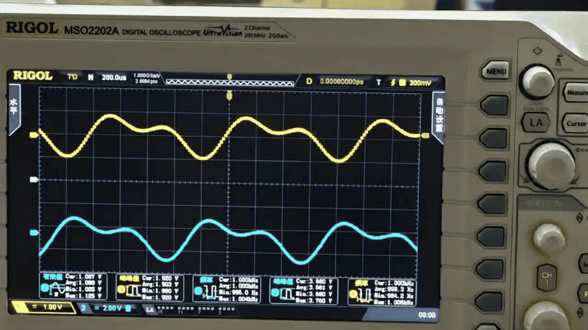
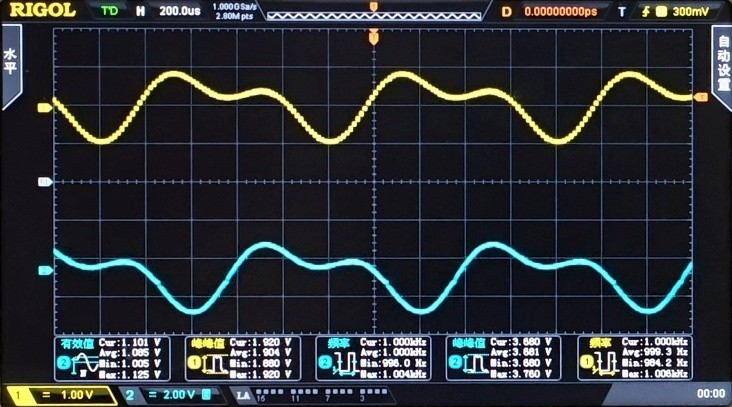

<div align="center">

[简体中文](README.md) | **English**




Demo note: after model learning, the waveform is reconstructed in time domain from the learned frequency response.

# STM32-accelerator

2025 Electronic Design Contest (Signal Problem G): STM32H750-based black-box circuit learning, frequency-domain identification, and real-time waveform reconstruction

[](https://www.st.com/en/microcontrollers-microprocessors/stm32h750vb.html)
[](https://www.freertos.org/)
[](https://arm-software.github.io/CMSIS-DSP/main/)
[](./Core)
[](./Module)
[](./MDK-ARM)

---

</div>

## Overview

This project targets Problem G (signal category) of the 2025 Electronic Design Contest and implements a complete **learn-identify-reconstruct** loop:

- Learning stage: sweep excitation via `AD9954`, and synchronized dual-`ADC` sampling of input/output
- Identification stage: `FFT` + complex frequency response extraction to estimate `H(jω)` and classify filter types
- Reconstruction stage: harmonic analysis of input, response mapping with learned transfer characteristics, and real-time waveform output via on-chip `DAC`

Core signal path:

`Excitation (AD9954 / on-chip DAC) -> dual-ADC synchronized sampling -> frequency-domain analysis & identification -> transfer mapping -> harmonic reconstruction -> DAC/DDS output`


## Key Features

- Synchronized dual-ADC sampling: `ADC_DUALMODE_REGSIMULT` + DMA for stable phase relation
- Frequency-domain pipeline: `FFT_LENGTH=4096`, with windowing and spectral interpolation
- Dual operation modes: `ADC_MODE_SWEEP` (sweep learning) and `ADC_MODE_RECONSTRUCT` (signal reconstruction)
- Software DDS output path for reconstructed waveform playback
- Engineering-grade validation with automation scripts in `RigolController`

## Project Structure

```text
STM32-accelerator/
├── Core/                      # CubeMX-generated startup/ISR/RTOS entry
├── Drivers/                   # HAL/CMSIS and peripheral drivers
├── Module/                    # Application modules (ADC / DAC / Frequency / Parser / UART / Timer)
├── MDK-ARM/                   # Keil project files
├── RigolController/           # Host-side automation scripts (frequency/amplitude sweep)
├── Document/                  # Design and optimization documents
├── assets-of-README/          # README assets
├── wave_construct.md          # Waveform reconstruction notes
└── 项目总档案-2025电赛G题.md  # Archived project summary in parent directory
```

## Tech Stack

| Category | Stack |
|---|---|
| MCU | `STM32H750VBT6` |
| Sampling path | dual `ADC` synchronized sampling + DMA + `TIM3` trigger |
| Output path | `AD9954` (excitation) + on-chip `DAC` (reconstruction output) |
| Frequency-domain algorithms | `CMSIS-DSP` FFT, windowing, spectral interpolation |
| Real-time scheduler | `FreeRTOS` |
| Toolchain | `STM32CubeMX` + `Keil MDK-ARM` |
| Validation tooling | Python + Rigol automation scripts |

## Performance Snapshot (with Conditions)

### Experiment Configuration

| Item | Configuration |
|---|---|
| ADC mode | `TIM3` trigger + `ADC_DUALMODE_REGSIMULT` |
| ADC resolution | `14-bit` |
| Sampling rate | `Fs ≈ 409.84 kHz` |
| FFT size | `4096` |
| Sweep range | `100 Hz ~ 50 kHz`, step `100 Hz` |
| Frequency resolution | `Δf ≈ 100.06 Hz` |
| Window length | `T_window ≈ 10 ms` |
| Output timing | `TIM4` (DAC), `TIM6` (reconstruction trigger) |

### Representative Results (Archived Data)

| Metric | Value | Source |
|---|---|---|
| Control error on known model output | `3.20% ~ 5.68%` | Competition report (PDF) |
| Frequency output error (100Hz~1MHz) | `0.1% ~ 2.4%` | Competition report (PDF) |
| Mean frequency error | `0.0295%` | `RigolController/STM32H7_DDS_Frequency_Sweep_Test_20250730_215545.xlsx` |
| Max absolute frequency error | `1.1941%` | Same file |
| Mean amplitude error | `-4.0379%` | Same file |
| Max absolute amplitude error | `13.7%` | Same file |

> Note: amplitude errors depend on calibration, frequency band, load condition, and probe configuration.

## Quick Start

### 1) Open firmware project

- Keil project: `MDK-ARM/FinallAttackProject.uvprojx`
- Primary control modes: sweep learning (`S5`) and signal reconstruction (`S6`)

### 2) Build and flash

1. Select target and build in Keil
2. Flash firmware to the `STM32H750` board
3. Monitor serial logs for mode transitions and runtime status

### 3) Optional host-side auto test

```bash
cd RigolController
python simple_test.py
```

Use this to quickly evaluate frequency/amplitude errors and export result files.

## Documentation Index

- Project archive: `../项目总档案-2025电赛G题.md`
- Frequency module notes: `Module/Frequency/README.md`
- Automation summary: `RigolController/PROJECT_SUMMARY.md`
- Reconstruction notes: `wave_construct.md`
- ADC dataflow notes: `adc-dma-底层api.md`

## Acknowledgements

- FPGA/MCU SPI communication reference: [`FPGA_MCU_SPI_COM`](https://gitee.com/themql/FPGA_MCU_SPI_COM)
- STM32H7 high-speed sampling reference: [`21ic forum thread`](https://bbs.21ic.com/icview-3409296-1-1.html)

## License

No standalone license file is bundled in this subdirectory; usage follows the repository-level license/policy.