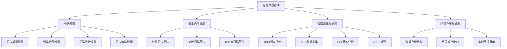

# STM32 扫频功能设计文档

## 1. 概述

本文档描述了在STM32平台上实现扫频功能的设计方案。扫频功能主要用于LCR表等应用中，通过在不同频率点上测量元件的阻抗特性，绘制频率特性曲线。

## 2. 系统架构



## 3. 功能模块设计

### 3.1 扫频控制模块
负责整体协调和控制扫频过程，包括：
- 初始化扫频参数
- 控制扫频流程
- 调用各子模块完成相应功能

### 3.2 参数配置模块
提供扫频参数的配置接口：
- 扫描类型：线性扫描、对数扫描
- 频率范围：起始频率、终止频率
- 扫描点数：总测量点数
- 扫描策略：根据元件特性选择不同的扫描策略

### 3.3 频率点生成器
根据配置参数生成频率点序列：
- 线性扫描：频率点等间距分布
- 对数扫描：频率点在对数坐标上等间距分布
- 自定义扫描：支持特殊频率点分布

### 3.4 数据采集与处理模块
控制硬件完成数据采集和处理：
- 控制DDS芯片输出指定频率的信号
- 触发ADC采集数据
- 调用FFT模块进行基波分析
- 计算ZLCR参数

### 3.5 结果存储与输出模块
存储测量结果并提供输出接口：
- 存储各频率点的测量数据
- 提供数据查询接口
- 支持实时数据显示和导出

## 4. 数据结构定义

### 4.1 扫频参数结构体
```c
typedef enum {
    SWEEP_LINEAR,     // 线性扫描
    SWEEP_LOGARITHMIC // 对数扫描
} sweep_type_t;

typedef enum {
    STRATEGY_QUICK_VIEW,      // 快速概览
    STRATEGY_STANDARD,        // 标准特性表征
    STRATEGY_FINE_ANALYSIS    // 精细分析
} sweep_strategy_t;

typedef struct {
    sweep_type_t type;           // 扫描类型
    uint32_t start_freq;         // 起始频率(Hz)
    uint32_t stop_freq;          // 终止频率(Hz)
    uint32_t points;             // 扫描点数
    sweep_strategy_t strategy;   // 扫描策略
} sweep_config_t;
```

### 4.2 扫频结果结构体
```c
typedef struct {
    uint32_t frequency;    // 频率(Hz)
    float32_t magnitude;   // 幅值
    float32_t phase;       // 相位(度)
    float32_t impedance;   // 阻抗(欧姆)
} sweep_point_result_t;
```

## 5. 核心函数接口

### 5.1 扫频控制函数
```c
void StartSweepTask(void const * argument);
```

### 5.2 频率点生成函数
```c
void generate_frequency_points(sweep_config_t* config, uint32_t* freq_array);
```

### 5.3 数据采集函数
```c
void collect_sweep_data(uint32_t frequency, sweep_point_result_t* result);
```

## 6. 扫描策略实现

### 6.1 快速概览策略
- 适用于：快速了解元件在某个频段的趋势
- 扫描点数：10到20个点
- 特点：测量速度快，但精度较低

### 6.2 标准特性表征策略
- 适用于：产品数据手册中的标准特性曲线
- 扫描点数：50到200个点
- 特点：平衡测量速度和曲线平滑度

### 6.3 精细分析策略
- 适用于：精确分析自谐振频率、滤波器通带/阻带特性等
- 扫描点数：数百到数千个点
- 特点：高精度测量，适用于关键参数分析

## 7. 不同扫描方式实现

### 7.1 线性扫描
频率点按等差数列分布：
```
f(n) = f_start + n * (f_stop - f_start) / (points - 1)
```

### 7.2 对数扫描
频率点在对数坐标上等间距分布：
```
f(n) = f_start * (f_stop / f_start) ^ (n / (points - 1))