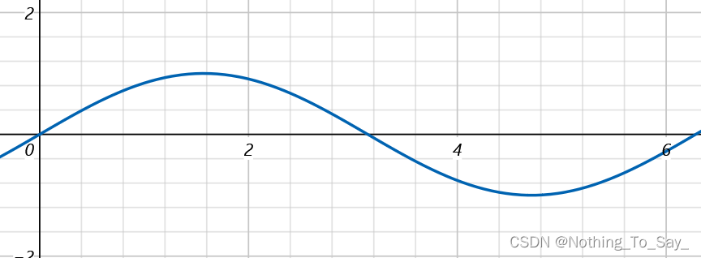
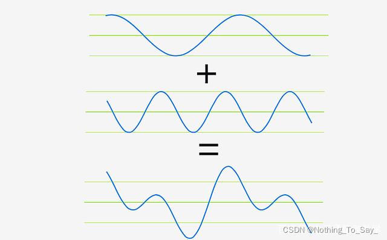
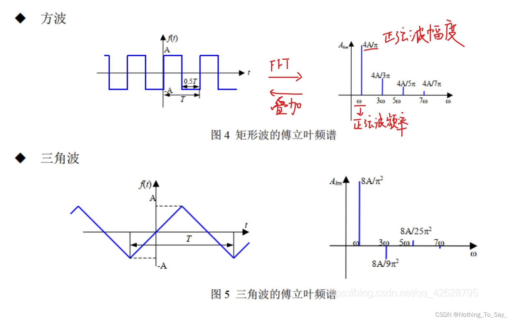
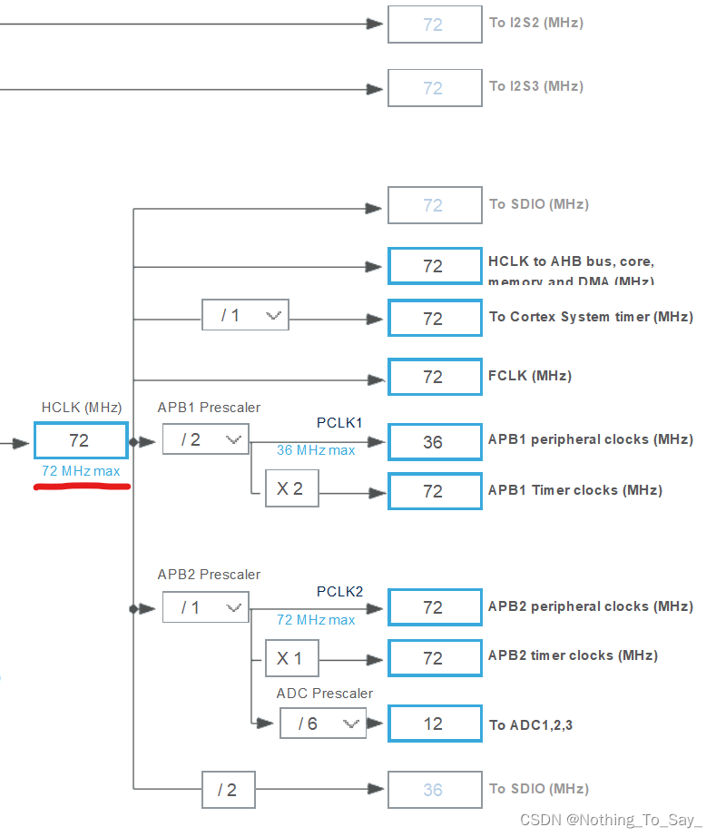
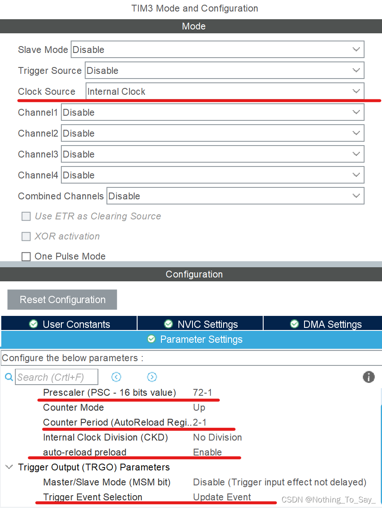

# STM32+CubeMX 通过RMS和FFT进行波形识别

## 波形识别

本文所展示的程序可以用于分辨**正弦波、三角波、方波**三种波形。  

#### 文章目录

*   [波形识别](#_2)
*   *   [思路](#_5)
    *   [可以判断波形的两个特点](#_17)
    *   *   [时域方面](#_19)
        *   [频域方面](#_56)
    *   [外设配置 & DSP库配置](#__DSP_85)
    *   [代码部分](#_111)
    *   *   [串口重定向](#_113)
        *   [时域部分](#_127)
        *   *   [变量定义](#_129)
            *   [ADC采集](#ADC_154)
            *   [求最大值，最小值，幅值](#_172)
            *   [取出波形的一个周期](#_181)
            *   [求取RMS](#RMS_214)
            *   [波形判断](#_227)
            *   [精度问题](#_243)
        *   [频域部分](#_294)
        *   *   [FFT求出频谱](#FFT_298)
            *   [判断波形](#_321)
            *   [提高精度](#_345)
    *   [感谢](#_392)
    *   [工程链接](#_401)

### 思路

利用不同波形某些方面的相互不同的特征为依据，即可分辨波形。

例如：通过**外形特点**我们可以分辨 乒乓球 和 羽毛球


对于单片机，我们要选择可以用数值表示，用统一方法计算的特征来识别波形。

### 可以判断波形的两个特点

#### 时域方面

我们发现，不同波形的有效值（RMS）是不同的。而且不同波形有效值可以通过一个固定的公式求出。

**交流电有效值**（RMS）又叫均方根值，_是一种用以计量交流电大小的值，交流电通过某电阻，在一周期内所产生的热量与直流电通过该电阻在同样时间内产生的热量相等，该直流电的大小就是交流电的有效值。_

已知通过ADC采集得到的波形离散的电压值，可以通过以下公式来计算RMS。假设ADC采集N个点的电压**X\[i\]** (1<=i<=N)：  
X r m s = X \[ 1 \] 2 + X \[ 2 \] 2 + . . . + X \[ n \] 2 N X{rms}= \\sqrt { X\[1\]^2 + X\[2\]^2 + ...+X\[n\]^2 \\over N } Xrms\=NX\[1\]2+X\[2\]2+...+X\[n\]2​ ​  
不同波形的有效值如下(A代表幅度)：

| 波形  | 正弦波 | 方波  | 三角波 |
| --- | --- | --- | --- |
| 有效值 | 0.707A | 1A  | 0.577A |

只要求出待测波形的有效值，与标准值相比对，即可辨别波形。

**需要注意的是**：

*   计算有效值时，待测波形的位置必须**关于时间轴对称**，所以在计算前要把所有波平移到关于时间轴对称的位置。
*   待测波形的离散点**必须**形成**整数个完整**的周期，也就是说，需要从ADC采集的点中取出一个或整数个完整周期的点。  
    如果不符合以上两个条件，算出的RMS会与给出的标准值不同，也就无法用固定的标准识别波形。

求取RMS的代码也并不复杂，**stm32DSP库中有封装好的求取RMS值的函数，我们这里不再手动实现，直接调用函数。**

函数原型如下：

```c
arm_rms_f32 (const float32_t *pSrc， uint32_t blockSize， float32_t *pResult)
三个参数分别代表目标数组，数组长度，计算结果
例子：
arm_rms_f32 (wave, 1024, &RMS);  //对长度为1024的wave数组求均方根值并把结果存在RMS中。
```

#### 频域方面

首先抛出一个结论，**所有波形都是由不同幅度、频率的正弦波叠加而成**。



*   例如：
*   一个频率为f、幅度为A的三角波可以视作是是由频率为f、幅度为8A/pi2的正弦波，频率为3f、幅度为8A/9pi2的正弦波，频率为5f、幅度是8A/25pi2的正弦波，等等叠加而成的。
*   正弦波可以视作是其自身叠加成的。

为了方便的表示出某种波形是由哪几种正弦波叠加成的，我们可以用频谱直观的表示出来。如下图右侧。



定义频谱中**幅度最大**的正弦波为**基波**，**幅度第二大**的正弦波为**三次谐波**。

观察上述波形的频谱，我们可以得到：

*   方波的**基波幅度**是**三次谐波幅度**的**三倍**。
    
*   三角波的基波幅度是三次谐波幅度的**九倍**。
    
*   正弦波的频谱中**不会出现**三次谐波。
    

基于以上特点，我们便可以辨别不同波形了。

可以看出，对于不同的波形，组成的他们的正弦波的幅度、频率各不相同，如果能够求出这些正弦波的幅度、频率，就可以判断不同的波形。我们可以利用傅里叶变换（FFT）来求波形的频谱，算法本身非常复杂，但stm32的DSP库中内置了相关的库函数，我们直接按照固定化的步骤进行调用即可。

### 外设配置 & DSP库配置

此部分需要配置ADC和串口，还不太清楚以下部分怎样配置的同学，可以参考以下博客进行配置，在此感谢学长提供的教程。

*   [↓↓↓](https://blog.csdn.net/qq_34022877/article/details/121941236?spm=1001.2014.3001.5502)  
      
    STM32HAL ADC+TIM+DMA采集交流信号 基于cubemx\_  
    四臂西瓜的博客（含串口重定向）  
      
      
    [↑↑↑](https://blog.csdn.net/qq_34022877/article/details/121941236?spm=1001.2014.3001.5502)
    
*   [配置DSP库—四臂西瓜的博客](https://blog.csdn.net/qq_34022877/article/details/117855263?spm=1001.2014.3001.5502)
    

这里设置ADC采样率为500k：

*   时钟树配置  
    
    
*   触发ADC的定时器配置：  
      
    2022.3.23更新：利用RMS判断波形时，更改采样率为400k
    
    *   PSC 设置为 90-1
    *   ARR 设置为 2-1

### 代码部分

#### 串口重定向

```c
#include <stdio.h>  // 及其重要 加在main.c 中 usart.c中   或者直接加在main.h   keil中勾选微库

int fputc(int ch, FILE *f)
{
  HAL_UART_Transmit(&huart1, (uint8_t *)&ch, 1, 0xffff);
  return ch;
}
```

#### 时域部分

##### 变量定义

```c
#define length 1024        // ADC采集的点的个数
uint16_t i,j;                // 循环变量，length 改变及时修改变量范围
uint32_t max_pos, min_pos; // 存储最大值最小值下标
uint16_t adc_buff[length]; //存放ADC采集的数据
uint16_t flag[length];     // 是否被搜索过
uint8_t n;                 // 第几大、小值
uint16_t temp;
uint16_t Npoints; //一个周期内的点的个数
float fft_inputbuf[length * 2];
float fft_outputbuf[length];
/*
AdcConvEnd用来检测测ADC是否采集完毕
0：没有采集完
1：采集完毕，在stm32f1xx_it里的DMA完成中断进行修改
 */
__IO uint8_t AdcConvEnd = 0;       //__IO 防止MDK优化
float vmax, vmin, vpp;             // 波形电压的最大值，最小值，幅值
float wave[length], wave1[length]; // 存放adc转换后的波形的值
float RMS;
float fre, Fmax; //频率
```

##### ADC采集

```c
HAL_Delay(500);						//防止连续采集过快导致测量误差过大
HAL_TIM_Base_Start(&htim3);          // 开启定时器3
HAL_ADCEx_Calibration_Start(&hadc1); // AD校准
HAL_ADC_Start_DMA(&hadc1, (uint32_t *)adc_buff, 1024);

  while (!AdcConvEnd)
    ; //等待转换完毕

for (i = 0; i < length; i++)
{
   wave[i] = adc_buff[i] * 3.3 / 4095; // 转换电压
}
```

##### 求最大值，最小值，幅值

```c
  arm_max_f32(wave, 1024, &vmax, &max_pos); //DSP库自带的求最值函数
  arm_min_f32(wave, 1024, &vmin, &min_pos);
  vpp = vmax - vmin;
```

##### 取出波形的一个周期

由于ADC误差的原因，用统计同一值出现次数来取出一个周期变得非常困难，所以我们选择进行FFT先求出波形的频率，通过  
N 周 期 点 数 = f 采 样 率 f 波 形 N\_{周期点数} = {f\_{采样率} \\over f\_{波形}} N周期点数​\=f波形​f采样率​​  
可求出一个周期点数，从而实现取出一个周期的波形。

```c
 for (int i = 0; i < length; i++)
  {
    fft_inputbuf[i * 2] = adc_buff[i];
    fft_inputbuf[i * 2 + 1] = 0;
  }

  arm_cfft_f32(&arm_cfft_sR_f32_len1024, fft_inputbuf, 0, 1);
  arm_cmplx_mag_f32(fft_inputbuf, fft_outputbuf, length);
  fft_outputbuf[0] /= 1024;

  for (int i = 1; i < length; i++)
  {
    fft_outputbuf[i] /= 512;
  }

  fft_outputbuf[0] = 0;
  arm_max_f32(fft_outputbuf, length, &Fmax, &max_pos);  //求取基波频率 基波的幅度是频谱中最大的 基波频率=原波形频率
  fre = (float)400000 / 1024 * max_pos;

  Npoints = 400000 / fre;
  for (i = 0; i < Npoints; i++)
    wave1[i] = wave[i];		//取出一个周期的点存在wave1[i]中
```

##### 求取RMS

需要注意的一点是，需要求出**RMS与平移后幅度的比值**，这个值才是固定不变的，不要忘记。

```c
 for (i = 0; i < Npoints; i++)
    wave1[i] = wave1[i] - vmin - vpp / 2; //将波形平移到与时间轴对称的位置

  arm_rms_f32(wave1, Npoints, &RMS); // DSP库封装好的求rms值函数 不再手动实现 原型： arm_rms_f32 (const float32_t *pSrc, uint32_t blockSize, float32_t *pResult)
  RMS = RMS / (vpp / 2);     // 平移后波形的幅度就是所求的vpp的一半
```

##### 波形判断

此处判断波形的RMS值范围是经过多次实测后确定的，要依据实际情况修改。

```c
 printf("RMS:%f\r\n", RMS);

  if (RMS > 0.64 && RMS < 0.8)
    printf("正弦波   \r\n");
  if (RMS > 0.8)
    printf("方波   \r\n");
  if (RMS < 0.63)
    printf("三角波  \r\n");
```

**至此，时域部分程序已经能实现基本功能，下面我们来讨论以下精度问题。**

##### 精度问题

1.减小电压最值的测量误差

*   由于ADC采集的误差，会有一部分点会大于实际波形电压的最大值，我们可以求第n大值来减小最大值测量的误差，最小值同理。
    
*   这样写求n大值可能略显繁琐，但容易修改，如果求第5大值，只需修改n=5即可，注意数组上下界即可，在n值较大时代码量也不会很多。
    

```c
  n = 4; // 求第n大值
  memset(flag, 0, sizeof(flag));
  for (i = 1; i <= n; i++)
  {
    vmax = 0.0;
    for (j = 0; j < length; j++)
    {
      if (flag[j] == 1)
        continue;
      if (vmax < wave[j])
      {
        vmax = wave[j];
        temp = j; // 记录最大值小标
      }
    }
    flag[temp] = 1; // 给已经做过最大的数做标记，在下次搜索时跳过
  }

  n = 4; // 求第n小值
  memset(flag, 0, sizeof(flag));
  for (i = 1; i <= n; i++)
  {
    vmin = 3.3;
    for (j = 0; j < length; j++)
    {
      if (flag[j] == 1)
        continue;
      if (vmin > wave[j])
      {
        vmin = wave[j];
        temp = j;
      }
    }
    flag[temp] = 1;
  }

  vpp = vmax - vmin;
```

~2.由于ADC测量的误差，导致本文通过RMS判断波形的程序 **无法测出** **1Khz，Vpp小于等于200mv**的波形。作者暂时没有找到解决方案，如有大佬有方法可以解决，恳请抽时间分享一下方法，感谢。~  
（2022.3.23 更新：此问题可以通过降低采样率解决——将采样率将采样率降低至400k，微调方波的判断范围即可成功解决，正文程序已做相应修改。）

#### 频域部分

变量定义，ADC采集与时域部分相似不再赘述

##### FFT求出频谱

```c
for (int i = 0; i < length; i++)
  {
    fft_inputbuf[i * 2] = wave[i];
    fft_inputbuf[i * 2 + 1] = 0;
  }

  arm_cfft_f32(&arm_cfft_sR_f32_len1024, fft_inputbuf, 0, 1);
  arm_cmplx_mag_f32(fft_inputbuf, fft_outputbuf, length);
  fft_outputbuf[0] /= 1024;

  for (int i = 1; i < length; i++)
  {
    fft_outputbuf[i] /= 512;
  }

 fft_outputbuf[0] = 0; //直流分量置0，以防影响求最大值。
 arm_max_f32(fft_outputbuf, 1024, &Amax, &Amax_pos);  //求出基波在频谱中的位置
```

##### 判断波形

```c
 k = fft_outputbuf[Amax_pos] / fft_outputbuf[3 * Amax_pos];

  if (k < 4 && k > 2)         //方波的 基波幅度 是三次谐波幅度的 三倍。 实际测量在2~4之间浮动
    printf("方波\r\n");

  if (k < 12 && k > 6)       //三角波的基波幅度是三次谐波幅度的 九倍。  实际测量在 6 ~ 12 间浮动
    printf("三角波\r\n");

  if (k > 13)
    printf("正弦波\r\n");     //正弦波理论上三次谐波幅度是0，k值会非常大。

  printf("k值=%f\r\n", k);
  printf("基波幅度=%f\r\n", fft_outputbuf[Amax_pos]);
  printf("三次谐波幅度=%f\r\n", fft_outputbuf[3 * Amax_pos]);
  printf("基波所在下标=%d\r\n", Amax_pos);
```

**至此，频域部分程序已经能实现基本功能，下面我们来讨论以下精度问题。**

##### 提高精度

**聚集能量，减少栅栏效应**  
fft求取频谱时，由于数组元素对应的频率，可能并非与基波频率、三次谐波等的频率完全对应，会导致栅栏效应，导致能量分散，求出的正弦波幅度会有较多误差，我们用先求平方和后开方的方法来聚集能量，减小误差。表达式如下：

E \[ n \] = E \[ n − i \] 2 + . . . + E \[ n − 2 \] 2 + E \[ n − 1 \] 2 + E \[ n \] 2 + E \[ n + 1 \] 2 + E \[ n + 2 \] 2 + . . . + E \[ n + i \] 2 E\[n\] = \\sqrt {E\[n-i\]^2 +...+E\[n-2\]^2+E\[n-1\]^2+E\[n\]^2+E\[n+1\]^2+E\[n+2\]^2+...+E\[n+i\]^2} E\[n\]\=E\[n−i\]2+...+E\[n−2\]2+E\[n−1\]2+E\[n\]2+E\[n+1\]2+E\[n+2\]2+...+E\[n+i\]2 ​

```c
  fre = 500000 / 1024 * Amax_pos; //计算频率，为了在聚集能量时，尽可能多聚并防止数组越界。

  if (fre > 1100)                          // 采用500hz采样率时，当频率大于1100hz时，此时有足够的频率差可以进行聚集能量
  {
    d = Amax_pos - 2;                    // 计算要聚集能量的范围  ,这里判断波形只需要基波和三次谐波，所以我们只聚两个点。减去2 是为了减去自身防止重复，和防止聚集上直流分量。
    temp = sqr(fft_outputbuf[Amax_pos]); //暂时存储 平方之和   
    //sqr()是我们自己定义的函数，可以起到简化表达式的作用
    for (i = 1; i <= d; i++)
    {
      temp = temp + sqr(fft_outputbuf[Amax_pos + i]) + sqr(fft_outputbuf[Amax_pos - i]);
      fft_outputbuf[Amax_pos + i] = 0;
      fft_outputbuf[Amax_pos - i] = 0;
    }
    fft_outputbuf[Amax_pos] = sqrt(temp);
  }

  d = Amax_pos - 2;
  temp = sqr(fft_outputbuf[Amax_pos * 3]);  //聚集三次谐波的能量，根据频谱三次谐波的频率时基波频率的三倍，对应数组下标乘三即可
  for (i = 1; i <= d; i++)
  {
    temp = temp + sqr(fft_outputbuf[Amax_pos * 3 + i]) + sqr(fft_outputbuf[Amax_pos * 3 - i]);
    fft_outputbuf[Amax_pos * 3 + i] = 0;
    fft_outputbuf[Amax_pos * 3 - i] = 0;
  }
  fft_outputbuf[Amax_pos * 3] = sqrt(temp);
```

```c
double sqr(double x)
{
	return x*x;   //放在user code begin 4 处。并且在user code PFP处进行声明，此处省略。
}
```

### 感谢

感谢为此篇博客提供帮助的同学和学长。

本篇博客的代码部分参考了 杨朔学长 和 朱康同学 的程序。

参考借鉴了唐承乾学长的博客，也感谢这段时间以来学长的辛勤答疑，给了我们很大帮助。

### 工程链接

[RMS波形识别](https://download.csdn.net/download/Nothing_To_Say_/85006453)  
[FFT波形识别](https://download.csdn.net/download/Nothing_To_Say_/85006455)
